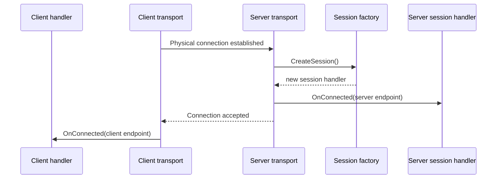
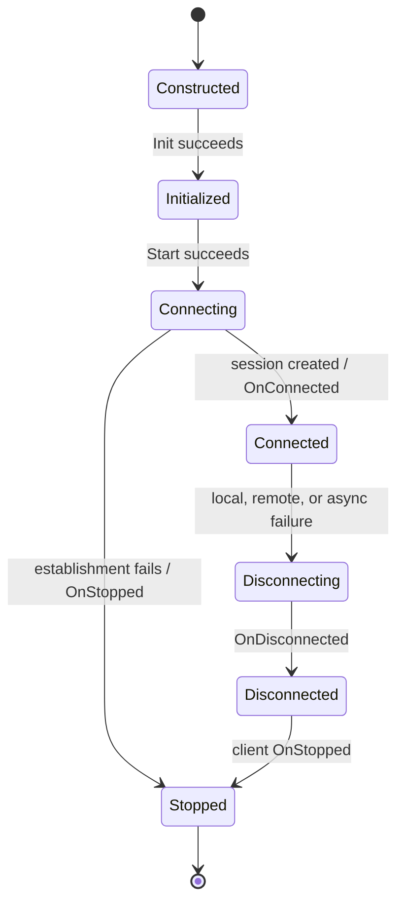

# NoAckRawReliable Transport Specification

## 1. Scope

NoAckRawReliable is a bidirectional, connection-oriented transport contract for
opaque `UnionDataList` messages. It defines:

- automatic session creation for each new physical connection, without an
  admission handshake;
- per-connection endpoint and callback lifecycles;
- ordered, duplicate-free delivery within a live logical connection;
- ownership rules for transport buffers; and
- responsibilities of application logic and transport implementations.

This specification is implementation-agnostic. It does **not** define wire
format, version negotiation, authentication, authorization, confidentiality,
integrity protection, timeout policy, keep-alive policy, or automatic
reconnection. Those concerns belong to the selected transport implementation
or to a protocol layered above NoAckRawReliable.

## 2. Normative language

The key words **MUST**, **MUST NOT**, **REQUIRED**, **SHOULD**, **SHOULD NOT**,
and **MAY** in this document are to be interpreted as described in
[RFC 2119](https://datatracker.ietf.org/doc/html/rfc2119).

## 3. Terms and roles

| Term | Meaning |
| --- | --- |
| **client** | The side that initiates a physical connection. |
| **server** | The side that listens for connections and creates a session handler automatically for each new source. |
| **session** | One accepted server-side connection, represented by exactly one server handler. |
| **endpoint** | The transport-provided object used to send regular messages, disconnect, and inspect connection metadata. |
| **regular message** | An application `UnionDataList` sent through `Send`. It excludes transport-control traffic. |
| **logical connection** | The application-visible connection lifetime from `OnConnected` through `OnDisconnected`. It can end before an underlying physical transport is fully closed. |
| **accepted send** | A `Send` invocation that returns `SendResult.Ok`. It has entered the transport's outbound delivery responsibility. |
| **delivery prefix** | The zero or more earliest accepted sends that reach the peer before the connection terminates. |

`RemoteEndPoint` is addressing metadata only. It **MUST NOT** be treated as an
authenticated identity, authorization claim, or proof of peer ownership.

## 4. Responsibilities at a glance

| Topic | Guaranteed by NoAckRawReliable | Application responsibility | Implementation-defined |
| --- | --- | --- | --- |
| Session creation | Every new physical connection automatically receives a server session handler. | Ensure the session factory creates a fresh handler per call. | How new connections are detected and mapped to sessions. |
| Delivery | Accepted sends are delivered at most once, in per-direction order, until termination. | Add application receipts when confirmation is required. | Wire framing and transmission mechanism. |
| Backpressure | `BufferOverflow` is non-fatal. | Retry later using a newly created buffer and an application backpressure policy. | Queue capacity and drain rate. |
| Callbacks | Per-connection callbacks are serialized and non-reentrant. | Return promptly, release owned buffers, and protect state shared between sessions. | Callback thread or scheduler. |
| Failure | Synchronous send failures are non-fatal; asynchronous failures end the logical connection. | Handle teardown and create a new connection when needed. | Timeout, keep-alive, and failure-detection policy. |
| Security | No security property is implied. | Choose authenticated and protected transports or implement protection above this layer. | Any implementation-specific protection. |

## 5. Session creation

NoAckRawReliable has no admission handshake. The server creates a session
handler automatically for each new physical connection. Regular messages
**MUST NOT** be exposed to application handlers before their side has completed
`OnConnected`.



### 5.1 Client responsibilities

1. The client handler receives its endpoint in `OnConnected`.
2. A client enters its logical connection only when its
   `OnConnected(INoAckRawReliableClientSideEndpoint)` callback is invoked.

### 5.2 Server responsibilities

1. The server **MUST** call `CreateSession` on its session factory for each new
   physical connection.
2. `CreateSession` **MUST** return a fresh server handler for each new session.
   A handler instance **MUST NOT** serve multiple sessions.
3. The server **MUST** invoke `OnConnected` on the session handler after the
   handler is created.
4. If the session factory throws, the connection **MUST** be dropped and the
   handler receives no lifecycle callback.
5. Calls to `CreateSession` on one server **MUST NOT** overlap concurrently.

Server `OnConnected` **MAY** run before the client receives the corresponding
notification or runs its own `OnConnected`.

### 5.3 Callback discipline

No endpoint operation is available before `OnConnected`. Handshake callbacks
(`CreateSession`) **MUST** return promptly; expensive construction work
**SHOULD** be delegated so session creation is not stalled.

Transport-control traffic **MUST NOT** be delivered through `OnReceived`.

## 6. Connection lifecycle



The client callback sequences are:

```text
successful connection: OnConnected -> OnDisconnected -> OnStopped
failed establishment:  OnStopped
```

For each successfully connected server session, `OnDisconnected` **MUST** occur
exactly once. Server handlers do not have an `OnStopped` callback.

During `OnConnected`, the endpoint **MUST** already be usable:

- `IsConnected` **MUST** be `true`;
- `RemoteEndPoint` **MUST** be non-null;
- `Send` and `Disconnect` are valid operations.

During and after `OnDisconnected`, `IsConnected` **MUST** be `false` and
`RemoteEndPoint` **MUST** be `null`. No further `OnReceived` callback may occur.
For a connected client, `OnDisconnected` and `OnStopped` **MUST** each occur
exactly once and in that order.

`Init` **MUST** succeed before `Start`. `Init` and `Start` are one-time
operations: NoAckRawReliable clients and servers are single-use and **MUST NOT**
be reinitialized or restarted after stopping. If `Start` returns `false`, the
transport is permanently invalid and no handler lifecycle callback is
guaranteed; the caller **MUST** handle that return directly.

There is no automatic reconnect or session resume. A disconnect is terminal;
application logic that wants reconnection **MUST** create a new client and a new
logical session.

## 7. Endpoint operations

### 7.1 Endpoint metadata

`IsConnected`, `RemoteEndPoint`, and `MessageMaxByteSize` **MUST** be safe to
read concurrently. `MessageMaxByteSize` is an inclusive maximum for the
application payload in a `UnionDataList`; it excludes transport framing and
control metadata. The client and server endpoints for one established
connection **MUST** report the same limit. Empty regular payloads are valid.

### 7.2 `Send`

`Send(UnionDataList)` is thread-safe. Concurrent successful sends on one
endpoint are ordered by the transport's linearization order for those calls.
`Send` **MUST NOT** wait for network delivery or peer handling; it returns after
validation and outbound admission.

`SendResult.Ok` means only that the transport accepted the message for
delivery. It is **not** a peer receipt and does not mean that `OnReceived` has
run. NoAckRawReliable provides no application-visible message acknowledgement,
retry, receipt, or delivery-confirmation callback. Applications requiring a
receipt **MUST** define one above this transport.

For each direction independently:

1. An accepted regular message **MUST** be delivered no more than once.
2. Delivered messages **MUST** preserve the order of accepted sends.
3. If termination interrupts delivery, the peer **MAY** receive only a contiguous
   prefix of the accepted-send order. It **MUST NOT** receive a later accepted
   message after an earlier accepted message was lost.

The ordering guarantee is directional only. It does not define a total order
between messages sent concurrently in opposite directions.

Every `Send` invocation transfers ownership of its argument to the transport,
regardless of its `SendResult`. After calling `Send`, application code **MUST**
NOT read, mutate, retain, release, or retry using that buffer. The transport
may release or modify it internally.

```csharp
SendResult result = endpoint.Send(message); // Ownership transfers unconditionally.

if (result == SendResult.BufferOverflow)
{
    // Schedule application-defined backpressure handling. A retry must use a
    // newly created buffer containing the same logical message.
    ScheduleRetryWithNewBuffer();
}
else if (result != SendResult.Ok)
{
    RecordSynchronousSendFailure(result);
}
```

Every synchronous non-`Ok` result (`MessageTooBig`, `InvalidMessage`,
`InvalidAddress`, `NotConnected`, `BufferOverflow`, or `Error`) **MUST** leave
the logical connection unchanged. In particular, `BufferOverflow` is
non-fatal, and a later send **MAY** succeed. NoAckRawReliable offers no
queue-drained or writable notification; applications **MUST** choose their own
retry and backpressure policy.

If an asynchronous failure occurs after `Send` returns `Ok`, the transport
**MUST** destroy the logical connection and raise `OnDisconnected`. Delivery of
messages still outstanding at that point is unknown.

### 7.3 `Disconnect`

`Disconnect(reason)` is thread-safe and non-blocking. `true` means that this
call initiated logical teardown; completion is reported asynchronously through
lifecycle callbacks. `false` means that the endpoint is already disconnecting
or disconnected, and the original reason and teardown remain unchanged.

Once `Disconnect` returns `true`, the transport **MAY** discard already accepted
but undelivered outbound messages. The caller's reason **MUST** be supplied to
the local `OnDisconnected` and, for a client, local `OnStopped` as the exact
same `StopReason` instance. The remote peer's reason is implementation-defined
and **MUST NOT** be assumed to equal the local reason.

`Send` and `Disconnect` may race. Either operation may linearize first:
`Send` may return `Ok` and subsequently be discarded by teardown, or it may
return `NotConnected` if teardown wins.

Application logic **MAY** call `Send` and `Disconnect` from `OnConnected` or
`OnReceived`. `Send` in `OnDisconnected` **MUST** return `NotConnected` and
still consume its buffer according to the ownership rules. If `Disconnect` is
called from a callback, `OnDisconnected` **MUST** be deferred until that
callback returns; lifecycle callbacks **MUST NOT** be reentrant.

## 8. Callback concurrency and resource ownership

For one logical connection, all callbacks (`OnConnected`, `OnReceived`,
`OnDisconnected`, and client `OnStopped`) **MUST** be serialized and
non-reentrant. Callbacks for different server sessions **MAY** execute
concurrently. Application state shared across sessions **MUST** therefore be
thread-safe.

The callback thread or scheduler is implementation-defined. Handlers **MUST**
NOT rely on thread affinity. Handlers, including `CreateSession`, **MUST**
return promptly: blocking a callback can stall processing and contribute to
backpressure or transport timeout.

The following ownership rules are normative:

| Callback or operation | Owner after the call | Required action |
| --- | --- | --- |
| `Send(buffer)` | Transport | Caller **MUST** never use or release `buffer` again. |
| `OnConnected` | Handler | No buffer ownership; handler connects its endpoint. |
| `OnReceived(receivedBuffer)` | Receiving handler | **MUST** release exactly once. |

Every owner in this table **MUST** eventually release its transferred or owned
reference exactly once after finishing with it. An implementation **MAY** take
additional internal references, but it **MUST** balance those references without
releasing the owner's reference more than once.

```csharp
public void OnReceived(UnionDataList receivedBuffer)
{
    try
    {
        ProcessMessage(receivedBuffer);
    }
    finally
    {
        receivedBuffer.Release();
    }
}
```

The release obligation applies even when application processing fails. A
handler that needs data after a callback **MUST** retain or copy it according
to the `UnionDataList` resource contract, then release its callback-owned
reference exactly once.

## 9. Failure and transport shutdown

An exception thrown by application logic in `OnConnected` or `OnReceived`
**MUST** terminate the affected local logical connection with an
`ExceptionFail` containing that exact exception instance. Every affected local
teardown callback **MUST** receive that reason. The remote peer's reason
remains implementation-defined. An exception in `CreateSession` fails
establishment as described in Section 5. An exception in `OnDisconnected` or
client `OnStopped` **MUST NOT** create duplicate lifecycle callbacks.
Applications **MUST** use `try`/`finally` to release callback-owned buffers
before allowing an exception to escape.

When `Stop(reason)` is called on a connected client, normal teardown **MUST**
occur: `OnDisconnected(reason)` followed by `OnStopped(reason)`, both with the
exact supplied `StopReason` instance. If a started client is stopped or
otherwise terminates before `OnConnected`, it **MUST** receive exactly one
`OnStopped(reason)` with that exact instance and no `OnDisconnected`.

When `Stop(reason)` is called on a server, it **MUST** stop accepting new
connections and logically disconnect every active session with that exact
reason instance. The transport-level `onStopped` callback supplied to `Start`
**MUST** run only after all affected handler teardown callbacks have completed.

The following behavior is explicitly implementation-defined:

- connection-establishment timeout;
- idle, keep-alive, and failure-detection mechanism and timing;
- callback execution context;
- remote stop reason;
- outbound queue capacity, scheduling, and drain rate; and
- physical-connection behavior after logical disconnection.

## 10. Security considerations

NoAckRawReliable treats regular messages as opaque application data. It
provides **no** guarantee of:

- peer authentication or authorization;
- confidentiality;
- integrity or tamper detection;
- replay protection; or
- a stable identity derived from `RemoteEndPoint`.

Applications **MUST** use a protected and authenticated underlying transport or
implement the required security protocol above NoAckRawReliable.

## 11. Application-author conformance checklist

Application logic conforms to this specification only if it:

- [ ] calls `Init` successfully before `Start`, and handles `Start == false`;
- [ ] treats transport instances and client sessions as single-use;
- [ ] releases every `OnReceived` buffer exactly once;
- [ ] never accesses a buffer after passing it to `Send`;
- [ ] treats `SendResult.Ok` as queue admission rather than a delivery receipt;
- [ ] retries `BufferOverflow` only with a newly created buffer and an
      application-defined backpressure policy;
- [ ] keeps callbacks prompt and protects state shared by sessions;
- [ ] expects no callback thread affinity, no automatic reconnect, and no
      security protection from this contract; and
- [ ] implements application-level receipts when delivery confirmation is
      required.

## 12. Transport-implementer conformance checklist

An implementation conforms to this specification only if it:

- [ ] calls `CreateSession` for each new physical connection and serializes
      those calls;
- [ ] creates exactly one fresh server handler per session;
- [ ] delivers regular messages at most once, in accepted-send order, with
      only a contiguous prefix deliverable after termination;
- [ ] serializes callbacks and prevents lifecycle reentrancy per connection;
- [ ] allows concurrent `Send` calls and defines their order by linearization;
- [ ] transfers and releases buffers according to the ownership table;
- [ ] keeps every synchronous non-`Ok` send result non-fatal;
- [ ] terminates a connection after asynchronous failure or handler exception;
- [ ] preserves local disconnect reasons and performs the specified client and
      server teardown sequences;
- [ ] makes endpoint metadata safe for concurrent reads; and
- [ ] documents all implementation-defined timeout, rejection, queue, and
      execution-context behavior without weakening the normative contract.

