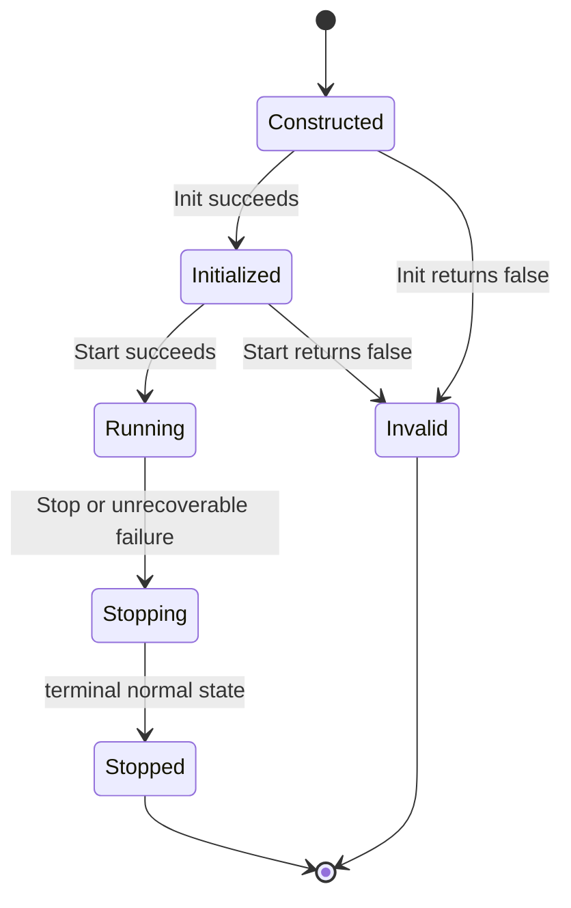
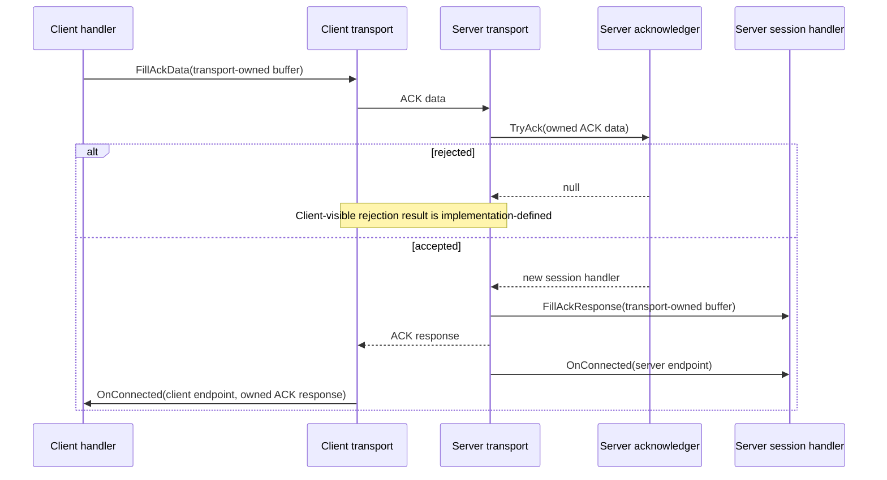
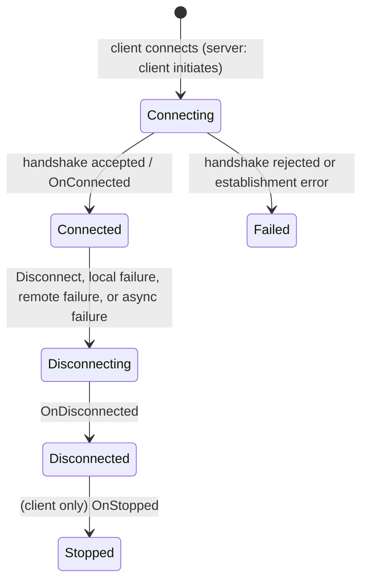

# RawReliableAck Transport Specification

## 1. Scope

RawReliableAck is a bidirectional, connection-oriented transport contract for
opaque `UnionDataList` messages. It defines:

- client admission through an ACK handshake;
- per-connection endpoint and callback lifecycles;
- ordered, duplicate-free delivery within a live logical connection;
- ownership rules for transport buffers; and
- responsibilities of application logic and transport implementations.

This specification is implementation-agnostic. It does **not** define wire
format, version negotiation, authentication, authorization, confidentiality,
integrity protection, timeout policy, keep-alive policy, or automatic
reconnection. Those concerns belong to the selected transport implementation
or to a protocol layered above RawReliableAck.

## 2. Normative language

The key words **MUST**, **MUST NOT**, **REQUIRED**, **SHOULD**, **SHOULD NOT**,
and **MAY** in this document are to be interpreted as described in
[RFC 2119](https://datatracker.ietf.org/doc/html/rfc2119).

## 3. Public contract

```csharp
public interface IRawReliableAckClient : IRawReliableTransport
{
    bool Init(IRawReliableAckClientHandler handler);
}

public interface IRawReliableAckClientHandler : IRawReliableClientHandler
{
    void FillAckData(UnionDataList ackData);
    void OnConnected(IRawReliableEndpoint endPoint, UnionDataList ackResponse);
}

public interface IRawReliableAckServer : IRawReliableTransport
{
    bool Init(IRawReliableAckServerAcknowledger<IRawReliableAckServerHandler> acknowledger);
}

public interface IRawReliableAckServerHandler : IRawReliableServerHandler
{
    void OnConnected(IRawReliableEndpoint endPoint);
    void FillAckResponse(UnionDataList ackData);
}

public interface IRawReliableAckServerAcknowledger<out THandler>
    where THandler : IRawReliableAckServerHandler
{
    THandler? TryAck(UnionDataList ackData);
}

public interface IRawReliableEndpoint : IRawEndpoint
{
    bool IsConnected { get; }
    SendResult Send(UnionDataList bufferToSend);
    bool Disconnect(StopReason reason);
}
```

`IRawReliableTransport` extends `IRawTransport` and supplies
`MessageMaxByteSize`. `IRawTransport` extends `ITransport` and supplies
`Name`, `IsValid`, `IsStarted`, `Start(Action<StopReason>)`, `Stop(StopReason?)`,
`Log`, `Memory`, `MessageMaxByteSize`, and `GetControls`.

`IRawReliableClientHandler` extends `IRawReliableHandler` and supplies
`OnStopped(StopReason)`. `IRawReliableServerHandler` extends
`IRawReliableHandler` and has no additional members (server handlers do not
receive `OnStopped`). `IRawReliableHandler` extends `IRawHandler` and supplies
`OnDisconnected(StopReason)`. `IRawHandler` supplies
`OnReceived(UnionDataList)`.

`IRawEndpoint` extends `IBaseEndpoint` and supplies `RemoteEndPoint`,
`MessageMaxByteSize`, and `GetControls`.

Clients and servers expose neither a transport-level receive event nor a
transport-level `TrySend` operation. A handler receives an
`IRawReliableEndpoint` through `OnConnected` and uses that endpoint for both
sending and logical disconnection.

## 4. Terms and roles

| Term | Meaning |
| --- | --- |
| **client** | The side that initiates a connection and supplies ACK data. It owns one `IRawReliableAckClient` transport instance. |
| **server** | The side that admits or rejects a client and creates a session handler. It owns one `IRawReliableAckServer` transport instance. |
| **transport** | One `IRawReliableAckClient` or `IRawReliableAckServer` instance. |
| **session** | One accepted server-side connection, represented by exactly one server handler. A server transport may manage zero or more independent sessions. |
| **endpoint** | An `IRawReliableEndpoint` representing one connection usable by application code for sending and receiving. It is not an `IEndPoint` routing value. |
| **regular message** | An application `UnionDataList` sent through `Send`. It excludes handshake and transport-control traffic. |
| **logical connection** | The application-visible connection lifetime from `OnConnected` through `OnDisconnected`. It can end before an underlying physical transport is fully closed. |
| **accepted send** | A `Send` invocation that returns `SendResult.Ok`. It has entered the transport's outbound delivery responsibility. |
| **delivery prefix** | The zero or more earliest accepted sends that reach the peer before the connection terminates. |
| **acknowledger** | The server-side `IRawReliableAckServerAcknowledger` bound by `Init`. It validates ACK data and creates session handlers. |
| **running** | The period after a successful `Start` and before stopping begins. |

RawReliableAck is connection-oriented: a client has one logical connection per
transport instance; a server creates one logical connection (session) per
accepted client. An endpoint is a local application handle for a connection,
not merely a routing path. `IEndPoint` is addressing metadata, not a security
principal or session identifier.

## 5. Responsibilities at a glance

| Topic | Guaranteed by RawReliableAck | Application responsibility | Implementation-defined |
| --- | --- | --- | --- |
| Admission | ACK data is presented to the server; a non-null handler accepts a session. | Authenticate and authorize inside `TryAck`. | How rejection is observed by the client. |
| Delivery | Accepted sends are delivered at most once, in per-direction order, until termination. | Add application receipts when confirmation is required. | Wire framing and transmission mechanism. |
| Backpressure | `BufferOverflow` is non-fatal. | Retry later using a newly created buffer and an application backpressure policy. | Queue capacity and drain rate. |
| Callbacks | Per-connection callbacks are serialized and non-reentrant. | Return promptly, release owned buffers, and protect state shared between sessions. | Callback thread or scheduler. |
| Failure | Synchronous send failures are non-fatal; asynchronous failures end the logical connection. | Handle teardown and create a new connection when needed. | Timeout, keep-alive, and failure-detection policy. |
| Transport failure | Unrecoverable transport failure stops and invalidates the transport. | Observe `onStopped`, recreate a transport after terminal failure, and log or surface application failures. | Failure detection mechanism and timing. |
| Conformance | An implementation claiming Carrier-Independent Core Conformance exposes the transport and endpoint conformance controls. | Use controls only in conformance adapters and never as application-plane behavior. | Whether an ordinary production instance exposes no controls or controls that remain inactive. |
| Security | No security property is implied. | Choose authenticated and protected transports or implement protection above this layer. | Any implementation-specific protection. |

## 6. Message model, size, and delivery eligibility

`MessageMaxByteSize` is an inclusive limit on the serialized `UnionDataList`
representation, including list and element encoding but excluding transport
framing and control metadata. The limit applies to regular messages, ACK data,
and ACK responses. It **MUST** be large enough to admit an empty
`UnionDataList`. `UnionDataList.GetDataSize()` defines the serialized size for
this contract. Empty regular and handshake payloads are valid.

The client and server endpoints for one established connection **MUST** report
the same `MessageMaxByteSize`.

Handshake and other transport-control traffic **MUST NOT** be delivered through
`OnReceived`.

An implementation **MUST NOT** deliver to `OnReceived` inbound data that is
malformed, cannot be decoded as a `UnionDataList`, or exceeds
`MessageMaxByteSize`. It **MUST** discard and log that data, and **MUST NOT**
stop or invalidate the transport or a session solely because of it. Handshake
data (ACK data and ACK response) that exceeds `MessageMaxByteSize` causes
establishment failure as described in Section 8.

Each `OnReceived` delivery transfers one complete `UnionDataList` containing
the same logical content. The transport **MUST NOT** fragment one message
across callbacks or merge messages into one callback.

### 6.1 Delivery guarantees

For each direction independently:

1. An accepted regular message **MUST** be delivered no more than once.
2. Delivered messages **MUST** preserve the order of accepted sends.
3. If termination interrupts delivery, the peer **MAY** receive only a
   contiguous prefix of the accepted-send order. It **MUST NOT** receive a
   later accepted message after an earlier accepted message was lost.

The ordering guarantee is directional only. It does not define a total order
between messages sent concurrently in opposite directions.

`SendResult.Ok` means only that the transport accepted the message for
delivery. It is **not** a peer receipt and does not mean that `OnReceived`
has run. RawReliableAck provides no application-visible message
acknowledgement, retry, receipt, or delivery-confirmation callback.
Applications requiring a receipt **MUST** define one above this transport.

## 7. Initialization and transport lifecycle

### 7.1 Initialization

`Init` binds the application callback object before a transport may start.
A client binds one non-null `IRawReliableAckClientHandler`. A server binds
one non-null `IRawReliableAckServerAcknowledger<IRawReliableAckServerHandler>`.

Passing null to `Init` **MUST** throw `ArgumentNullException` without changing
the transport state.

`Init` is a one-time operation. Concurrent calls are safe, but at most one
call may return true. Every racing or later call **MUST** return false. A
successful `Init` does not invoke `OnConnected`, create a session, or start
carrier activity.

The initial eligible `Init` attempt either succeeds or terminally invalidates
the transport. If it returns false, `IsValid` **MUST** become false, no later
`Init` or `Start` may succeed, and no `onStopped` callback is invoked. Calling
`Init` after a successful `Start`, after stopping begins, or after the
transport is invalid **MUST** return false.

`Start` requires a successful `Init`. Calling `Start` before successful
initialization **MUST** return false and terminally invalidate the transport
under the failed-start rules below.

### 7.2 Transport state



`Start` requires a non-null `onStopped` callback. Passing null **MUST** throw
`ArgumentNullException` without changing the instance lifecycle state.

`Start` is a one-time operation. Concurrent calls are safe, but at most one
call **MAY** return true; every racing or later call **MUST** return false. A
successful `Start` makes the server able to accept connections at its
configured address and makes the client able to connect to its configured
remote destination. It does not imply peer reachability or establish a
connection.

If the initial `Start` attempt returns false, including because `Init` has not
succeeded, the instance **MUST** become invalid, **MUST NOT** invoke the
supplied `onStopped` callback, and **MUST NOT** be restarted. A later or
racing `Start` call returns false without changing the already terminal
lifecycle state.

After a successful start, stopping is terminal: a stopped transport **MUST
NOT** be restarted or reinitialized. A normal transport stop does not
invalidate the instance: `IsValid` remains true while `IsStarted` becomes
false. An unrecoverable internal or carrier failure **MUST** invalidate the
transport. A `Stop` call before a successful `Start` is a no-op and returns
true.

`IsValid` and `IsStarted` **MUST** be safe for concurrent reads. `IsStarted`
is true only while the transport is running. `IsValid` becomes false after a
failed initialization, a failed start, or an unrecoverable transport failure.

For each successful `Start(onStopped)`, `onStopped` **MUST** be invoked
exactly once after the terminal state transition when the transport
subsequently stops, whether by `Stop`, a client endpoint disconnection that
stops the client, or an unrecoverable internal or carrier failure. The
callback MAY be invoked synchronously or asynchronously; `Stop` is not
required to wait for it. A transport-generated reason MAY preserve a supplied
reason as its cause; callers **MUST NOT** require object identity with a
supplied reason.

`Stop` is thread-safe and may be called from a handler. Once it returns, no
new `OnReceived` invocation may begin for any endpoint of that transport. A
handler already running may finish asynchronously. The transport may discard
all accepted-but-undelivered outbound messages and queued-but-not-yet-invoked
inbound messages while stopping. Calling `Stop` on a valid transport that is
already stopped returns true; it returns false after the transport has become
invalid.

### 7.3 Client connection startup

After `client.Start` has successfully returned true, the client **MUST** begin
connecting to the configured remote destination. It does not establish a
logical connection until the ACK handshake completes. If the handshake
succeeds, the client invokes `handler.OnConnected(endpoint, ackResponse)`.
If the handshake fails, the client invokes `handler.OnStopped(reason)`.

The client **MUST NOT** deliver `OnReceived` or `OnDisconnected` before
`OnConnected` returns successfully. The client endpoint is not available to
application code before `OnConnected`.

## 8. Admission handshake

The handshake admits a client; it is not a per-message acknowledgement
protocol. Regular messages **MUST NOT** be exposed to application handlers
before their side has completed `OnConnected`.



### 8.1 Client responsibilities

1. The client handler **MUST** populate the buffer supplied to `FillAckData`.
2. That buffer remains transport-owned scratch storage. The handler **MUST NOT**
   retain or release it.
3. The client endpoint is not available during `FillAckData`.
4. A client enters its logical connection only when its
   `OnConnected(IRawReliableEndpoint, UnionDataList)` callback is invoked.
5. If the populated ACK data exceeds `MessageMaxByteSize`, establishment
   **MUST** fail. The client **MUST** receive `OnStopped` without
   `OnConnected`; the failure reason is implementation-defined.

### 8.2 Server responsibilities

1. The server **MUST** invoke `TryAck` for each connection attempt.
2. Calls to `TryAck` on a server **MUST NOT** overlap concurrently.
3. `TryAck` **MUST** return a fresh server handler for each accepted session.
   A handler instance **MUST NOT** serve multiple sessions.
4. `TryAck` receives ownership of its ACK-data buffer and **MUST** release it
   exactly once after validation, including on an exceptional path.
5. Returning `null` rejects the connection attempt. The way that rejection
   reaches the client, including whether it is reported as `AckRejected`, is
   implementation-defined. The server **MUST NOT** cache a null return: a
   later connection attempt from the same source is eligible to invoke
   `TryAck` again.
6. For an accepted session, the server **MUST** call `FillAckResponse` before
   its `OnConnected`. The ACK response **MUST** be accepted for outbound
   delivery before server `OnConnected` is invoked.
7. `FillAckResponse` receives transport-owned scratch storage. The handler
   **MUST** populate it but **MUST NOT** retain or release it.
8. If a callback fails before the server handler's `OnConnected`, the session
   never became logical and that handler receives no lifecycle callback.
9. If the populated ACK response exceeds `MessageMaxByteSize`, establishment
   **MUST** fail. The client **MUST** receive `OnStopped` without
   `OnConnected`, and the pre-connected server handler receives no lifecycle
   callback. The client failure reason is implementation-defined.

Server acceptance is local. Server `OnConnected` MAY run before the client
receives the ACK response or runs its own `OnConnected`.

### 8.3 Handshake callback discipline

`FillAckData`, `TryAck`, and `FillAckResponse` are handshake callbacks. No
endpoint operation is available in them. They **MUST** return promptly;
expensive authentication, I/O, or construction work **SHOULD** be delegated
so admission processing is not stalled.

If `TryAck` throws, the server **MUST** catch and log the exception, release
and drop the ACK data, and leave no session binding for that connection
attempt. The transport **MUST NOT** stop or invalidate solely because `TryAck`
threw. A later connection attempt from the same source is eligible to invoke
`TryAck` again. If `FillAckResponse` throws, the server **MUST** treat it as
establishment failure: the pre-connected server handler receives no lifecycle
callback, and the client receives `OnStopped` without `OnConnected`.

## 9. Connection lifecycle

### 9.1 Logical connection state



### 9.2 Client lifecycle

The client callback sequences are:

```text
successful connection: OnConnected -> OnDisconnected -> OnStopped
failed establishment:  OnStopped
```

A client enters its logical connection only when `OnConnected` is invoked.
For a connected client, `OnDisconnected` and `OnStopped` **MUST** each occur
exactly once and in that order. During establishment failure, exactly one
`OnStopped` **MUST** occur and `OnDisconnected` **MUST NOT** occur.

During `OnConnected`, the endpoint **MUST** already be usable:

- `IsConnected` **MUST** be `true`;
- `RemoteEndPoint` **MUST** be non-null;
- `Send` and `Disconnect` are valid operations.

During and after `OnDisconnected`, `IsConnected` **MUST** be `false` and
`RemoteEndPoint` **MUST** be `null`. No further `OnReceived` callback may
occur.

`RemoteEndPoint` is addressing metadata only. It **MUST NOT** be treated as an
authenticated identity, authorization claim, or proof of peer ownership.

### 9.3 Server session lifecycle

For each accepted server session, the callback sequence is:

```text
OnConnected -> OnDisconnected
```

`OnDisconnected` **MUST** occur exactly once for each successfully connected
server session. Server handlers do not have an `OnStopped` callback.

The server session is independent of the server transport lifecycle with
respect to callbacks. A server transport may be stopped while sessions are
still active; the transport **MUST** disconnect all sessions before invoking
its `onStopped` callback.

There is no automatic reconnect or session resume. A disconnect is terminal;
application logic that wants reconnection **MUST** create a new client and a
new logical session.

## 10. Endpoint operations

### 10.1 Endpoint metadata

An `IRawReliableEndpoint` is valid and usable only while in or after a
`Connected` state and before its `Disconnecting` transition completes.

`IsConnected`, `RemoteEndPoint`, and `MessageMaxByteSize` **MUST** be safe to
read concurrently. `IsConnected` is true when the endpoint is in the Connected
state. It becomes false when the endpoint enters disconnecting and never
becomes true again.

`RemoteEndPoint` identifies the endpoint's immutable peer addressing metadata.
It **MUST** be non-null while `IsConnected` is true and null after the
endpoint has disconnected.

`MessageMaxByteSize` is immutable and safe for concurrent reads during the
endpoint lifetime. It has the same value and meaning as the owning transport's
`MessageMaxByteSize`. The client and server endpoints for one established
connection **MUST** report the same limit.

### 10.2 `Send` and `SendResult`

`Send(UnionDataList)` is thread-safe. Concurrent successful sends on one
endpoint are ordered by the transport's linearization order for those calls.
`Send` **MUST NOT** wait for network delivery or peer handling; it returns
after validation and outbound admission.

Every `Send` invocation transfers ownership of its argument to the transport,
regardless of its `SendResult`. After calling `Send`, application code **MUST
NOT** read, mutate, retain, release, or retry using that buffer. The transport
may release or modify it internally.

```csharp
SendResult result = endpoint.Send(message); // Ownership transfers unconditionally.

if (result == SendResult.BufferOverflow)
{
    // Schedule application-defined backpressure handling. A retry must use a
    // newly created buffer containing the same logical message.
    ScheduleRetryWithNewBuffer();
}
else if (result != SendResult.Ok)
{
    RecordSynchronousSendFailure(result);
}
```

An implementation **MUST** select a result using this precedence: endpoint
connection state, message validity and serializability, message size,
outbound capacity, then other synchronous errors.

| Result | Required meaning |
| --- | --- |
| `Ok` | The transport accepted the message for local delivery processing. It is not a peer receipt or delivery guarantee. |
| `NotConnected` | The endpoint is not connected. |
| `InvalidMessage` | The message is null, malformed, or cannot be serialized. |
| `MessageTooBig` | The serialized message exceeds `MessageMaxByteSize`. |
| `InvalidAddress` | The endpoint's underlying route is synchronously determined to be invalid. |
| `BufferOverflow` | The implementation cannot accept the message because its finite outbound capacity is full. |
| `Error` | The endpoint or transport is unavailable, or another unclassified synchronous sending error occurred. |

Every synchronous non-`Ok` result **MUST** leave the logical connection
unchanged. In particular, `BufferOverflow` is non-fatal, and a later send
**MAY** succeed. RawReliableAck offers no queue-drained or writable
notification; applications **MUST** choose their own retry and backpressure
policy.

If an asynchronous failure occurs after `Send` returns `Ok`, the transport
**MUST** destroy the logical connection and raise `OnDisconnected`. Delivery
of messages still outstanding at that point is unknown.

### 10.3 `Disconnect`

`Disconnect(reason)` is thread-safe and non-blocking. `true` means that this
call initiated logical teardown; completion is reported asynchronously through
lifecycle callbacks. `false` means that the endpoint is already disconnecting
or disconnected, and the original reason and teardown remain unchanged.

Once `Disconnect` returns true, the transport **MAY** discard already accepted
but undelivered outbound messages. The caller's reason **MUST** be supplied to
the local `OnDisconnected` and, for a client, local `OnStopped` as the exact
same `StopReason` instance. The remote peer's reason is implementation-defined
and **MUST NOT** be assumed to equal the local reason.

`Send` and `Disconnect` may race. Either operation may linearize first:
`Send` may return `Ok` and subsequently be discarded by teardown, or it may
return `NotConnected` if teardown wins.

Application logic **MAY** call `Send` and `Disconnect` from `OnConnected` or
`OnReceived`. `Send` in `OnDisconnected` **MUST** return `NotConnected` and
still consume its buffer according to the ownership rules. If `Disconnect` is
called from a callback, `OnDisconnected` **MUST** be deferred until that
callback returns; lifecycle callbacks **MUST NOT** be reentrant.

## 11. Callback concurrency and resource ownership

### 11.1 Serialization

For one logical connection, all callbacks (`OnConnected`, `OnReceived`,
`OnDisconnected`, and client `OnStopped`) **MUST** be serialized and
non-reentrant. Callbacks for different server sessions **MAY** execute
concurrently. Application state shared across sessions **MUST** therefore be
thread-safe.

Calls to `TryAck` on a server **MUST** be serialized globally: two
acknowledger invocations **MUST NOT** overlap. This does not require a
`TryAck` call to wait for existing handler callbacks.

The callback thread or scheduler is implementation-defined. Handlers **MUST
NOT** rely on thread affinity. Handlers, including `TryAck`, **MUST** return
promptly: blocking a callback can stall processing and contribute to
backpressure or transport timeout.

### 11.2 Buffer ownership

The following ownership rules are normative:

| Callback or operation | Owner after the call | Required action |
| --- | --- | --- |
| `Send(buffer)` | Transport | Caller **MUST** never use or release `buffer` again. |
| `FillAckData(buffer)` | Transport | Handler populates only; **MUST NOT** retain or release. |
| `FillAckResponse(buffer)` | Transport | Handler populates only; **MUST NOT** retain or release. |
| `TryAck(ackData)` | Acknowledger | **MUST** release exactly once after validation. |
| client `OnConnected(..., ackResponse)` | Client handler | **MUST** release exactly once. |
| `OnReceived(receivedBuffer)` | Receiving handler | **MUST** release exactly once. |

Every owner in this table **MUST** eventually release its transferred or owned
reference exactly once after finishing with it. An implementation MAY take
additional internal references, but it **MUST** balance those references
without releasing the owner's reference more than once.

```csharp
public void OnReceived(UnionDataList receivedBuffer)
{
    try
    {
        ProcessMessage(receivedBuffer);
    }
    finally
    {
        receivedBuffer.Release();
    }
}

public void OnConnected(
    IRawReliableEndpoint endpoint,
    UnionDataList ackResponse)
{
    try
    {
        ApplyServerAdmissionData(ackResponse);
        _endpoint = endpoint;
    }
    finally
    {
        ackResponse.Release();
    }
}
```

The release obligation applies even when application processing fails. A
handler that needs data after a callback **MUST** retain or copy it according
to the `UnionDataList` resource contract, then release its callback-owned
reference exactly once.

A handler that throws **MUST** still release any message reference it owns,
normally with `try`/`finally`. The transport **MUST** catch an `OnReceived`
exception, suppress further processing of only that delivery, and then
terminate the connection as specified in Section 13.1. Because ownership has
transferred to the handler, the transport is not required to release a
reference that a throwing handler failed to release.

## 12. Conformance controls

### 12.1 Scope and exposure

This section defines test-only controls required only from an implementation
claiming Carrier-Independent Core Conformance. A conformance adapter obtains a
transport control through `ITransport.GetControls` before starting the
transport. A handler obtains an endpoint control through
`IRawReliableEndpoint.GetControls` (inherited from `IBaseEndpoint.GetControls`)
after receiving that endpoint in `OnConnected`.

Implementations MAY expose these controls only from instances constructed by a
conformance adapter. Ordinary production instances **MUST NOT** incur
conformance-control hot-path overhead. Controls **MUST NOT** inject packets,
intercept application messages, fabricate `SendResult` values, or directly
invoke application callbacks.

All checkpoint controls described below are inactive until armed by a test.
When armed, a checkpoint hit invokes `ICheckPoint.Hit` and blocks according to
its `ICheckPointCtl`. Every returned control and getter **MUST** be safe for
concurrent use.

### 12.2 Transport conformance control

The transport control is named
`IRawReliableAckTransportConformanceControl` and extends
`IConformanceControl`. It therefore retains the transport-wide members
inherited from `IConformanceControl`:

- `BeforeStopStateTransitionGate`;
- `BeforeStoppedCallbackGate`;
- `FailNextStart()`; and
- `InjectUnrecoverableFailure()`.

`FailNextStart()` and `InjectUnrecoverableFailure()` apply to the whole
transport exactly as defined by `IConformanceControl`. In particular, injected
unrecoverable failure follows the ordinary transport failure path, disconnects
all sessions, and preserves this specification's session-disconnect callback
ordering. It **MUST NOT** fabricate data-plane or handler activity.

The transport-specific control additionally exposes these members:

```csharp
ICheckPointCtl BeforeAcknowledgerGate { get; }
ICheckPointCtl BeforeHandlerConnectedGate { get; }
```

`BeforeAcknowledgerGate` is hit once immediately before each server
`TryAck` invocation. It is not hit for malformed, oversized, stopped, or
otherwise discarded connection attempts. It is not hit for a client transport.
The gate participates in the global acknowledger serialization rule.

`BeforeHandlerConnectedGate` is hit once immediately before a handler's
`OnConnected(endpoint, ...)` invocation. It is hit for both client and server
handlers after the handshake has succeeded and the endpoint is valid, but
before application callback execution. It is not hit when a session is
rejected or when establishment fails.

### 12.3 Endpoint conformance control

The endpoint control is named
`IRawReliableAckEndpointConformanceControl` and extends `IControl`. It
exposes these members:

```csharp
ICheckPointCtl BeforeEndpointDisconnectStateTransitionGate { get; }
ICheckPointCtl BeforeHandlerDisconnectedGate { get; }
ICheckPointCtl BeforeHandlerStoppedGate { get; }
ICheckPointCtl BeforeSendCommitGate { get; }
ICheckPointCtl AfterSendCommitGate { get; }
ICheckPointCtl AfterReceivedGate { get; }
```

`BeforeEndpointDisconnectStateTransitionGate` is hit when a connected endpoint
is about to transition to disconnected, whether the cause is `Disconnect`,
local failure, remote failure, or owning-transport stop. The checkpoint occurs
before that transition becomes visible to a concurrent `IsConnected` read.

`BeforeHandlerDisconnectedGate` is hit once immediately before the endpoint
invokes `handler.OnDisconnected(reason)`. The endpoint is already disconnected
at this point.

`BeforeHandlerStoppedGate` is hit once immediately before a client handler's
`OnStopped(reason)` is invoked. The session has already been disconnected.
This gate is not triggered for server sessions (server handlers do not have
`OnStopped`). It is not hit for a client whose `OnConnected` was never invoked
and therefore receives only `OnStopped` without a preceding `OnDisconnected`;
in that establishment-failure path the endpoint is never exposed to the
handler.

`BeforeSendCommitGate` is hit when a message accepted from this endpoint is
about to reach an underlying IO commit attempt. Synchronously rejected
messages and accepted messages discarded before a commit attempt do not hit
this gate. `AfterSendCommitGate` is hit after that endpoint message completes
an underlying IO commit attempt.

`AfterReceivedGate` is hit once per impending `OnReceived` invocation for this
endpoint, immediately before it begins. It is not hit for malformed,
oversized, stopped, discarded, or handshake messages. It is not hit for
`OnConnected`, `OnDisconnected`, or `OnStopped`.

## 13. Failure and transport shutdown

### 13.1 Callback exceptions

An exception thrown by application logic in `FillAckData`, `OnConnected`, or
`OnReceived` **MUST** terminate the affected local logical connection with an
`ExceptionFail` containing that exact exception instance. Every affected local
teardown callback **MUST** receive that reason. The remote peer's reason
remains implementation-defined.

An exception in `TryAck` **MUST** be caught and logged; it fails the
individual connection attempt as described in Section 8.3. An exception in
`FillAckResponse` **MUST** fail establishment: the pre-connected server
handler receives no lifecycle callback, and the client receives `OnStopped`
without `OnConnected`.

An exception in `OnDisconnected` or client `OnStopped` **MUST NOT** create
duplicate lifecycle callbacks. The transport **MUST** catch and log the
exception and otherwise continue its already-determined teardown.

Applications **MUST** use `try`/`finally` to release callback-owned buffers
before allowing an exception to escape.

### 13.2 Client transport shutdown

When `Stop(reason)` is called on a connected client, normal teardown **MUST**
occur: `OnDisconnected(reason)` followed by `OnStopped(reason)`, both with the
exact supplied `StopReason` instance.

If a started client is stopped or otherwise terminates before `OnConnected`,
it **MUST** receive exactly one `OnStopped(reason)` and no `OnDisconnected`.

A client that disconnects from its single endpoint (via `Disconnect` or
endpoint failure) **MUST** stop the client transport. If `OnConnected`
completed successfully, the client **MUST** invoke `handler.OnStopped(reason)`
after `handler.OnDisconnected(reason)` and before the transport
`onStopped` callback. The transport `onStopped` callback **MUST** run after
the client handler teardown callbacks have completed.

### 13.3 Server transport shutdown

When `Stop(reason)` is called on a running server, it **MUST** stop accepting
new clients and logically disconnect every active session with that exact
reason instance. The server **MUST** schedule `OnDisconnected` for every
session handler whose `OnConnected` completed successfully before invoking the
server transport's `onStopped` callback.

The transport-level `onStopped` callback **MUST** run only after all affected
session `OnDisconnected` callbacks have been scheduled (they need not have
returned before `onStopped` begins).

A server `Stop` called before a successful `Start` returns true and does
nothing.

### 13.4 Unrecoverable failure

An unrecoverable internal or carrier failure after successful start **MUST**
stop and invalidate the transport, disconnect all sessions, discard work that
has not begun delivery, and invoke the transport `onStopped` exactly once.
For a server, session `OnDisconnected` notifications must be scheduled before
the transport `onStopped` callback as specified in Section 13.3.

### 13.5 Implementation-defined behavior

The following behavior is explicitly implementation-defined, provided it does
not weaken the requirements in this specification:

- handshake, idle, and keep-alive timeouts;
- failure-detection mechanism and timing;
- client-visible signaling of server rejection;
- callback execution context and scheduler;
- `onStopped` dispatch scheduler and timing after the terminal state
  transition;
- remote stop reason;
- outbound queue capacity, scheduling, and drain rate;
- physical-connection behavior after logical disconnection;
- carrier and wire encoding, including interoperability with other
  implementations;
- address configuration and endpoint representation;
- internal logging format and sink; and
- implementation-specific protection layered beneath this transport.

## 14. Security considerations

RawReliableAck treats ACK data, ACK responses, and regular messages as opaque
application data. It provides **no** guarantee of:

- peer authentication or authorization;
- confidentiality;
- integrity or tamper detection;
- replay protection; or
- a stable identity derived from `RemoteEndPoint`.

Applications **MUST** use a protected and authenticated underlying transport or
implement the required security protocol above RawReliableAck. Admission
logic in `TryAck` **SHOULD** validate all information required to create a
trusted session.

## 15. Application-author conformance checklist

Application logic conforms to this specification only if it:

- [ ] calls `Init` successfully exactly once before `Start`, and handles
      `Start == false`;
- [ ] never calls `Init` or `Start` after a successful `Start`, after
      stopping, or after the transport becomes invalid;
- [ ] treats transport instances and client sessions as single-use;
- [ ] authenticates and authorizes connections in `TryAck`;
- [ ] returns a fresh handler from every accepted `TryAck`;
- [ ] releases every `TryAck`, `OnConnected` ACK-response, and `OnReceived`
      buffer exactly once, including when processing fails;
- [ ] never accesses a buffer after passing it to `Send`;
- [ ] treats `SendResult.Ok` as queue admission rather than a delivery
      receipt;
- [ ] treats every synchronous non-`Ok` result as non-fatal and handles
      `BufferOverflow` with an application-defined backpressure policy;
- [ ] retries `BufferOverflow` only with a newly created buffer;
- [ ] sends and receives exclusively through the endpoint obtained in
      `OnConnected`;
- [ ] keeps callbacks prompt and protects state shared by sessions;
- [ ] expects no callback thread affinity, no automatic reconnect, and no
      security protection from this contract;
- [ ] observes `OnDisconnected` and `OnStopped`; does not expect a stopped
      transport to restart; and
- [ ] implements application-level receipts when delivery confirmation is
      required.

## 16. Transport-implementer conformance checklist

An implementation conforms to this specification only if it:

- [ ] enforces one-time, pre-start initialization and terminal invalidation on
      failed initialization or start;
- [ ] throws `ArgumentNullException` for null `Init` and null
      `Start(onStopped)` arguments without changing lifecycle state;
- [ ] performs the ACK admission flow and serializes `TryAck` calls;
- [ ] creates exactly one fresh server handler per accepted session;
- [ ] invokes server `OnConnected` only after its ACK response is accepted for
      outbound delivery;
- [ ] catches and logs `TryAck` and `FillAckResponse` exceptions without
      stopping the transport;
- [ ] handles ACK data and ACK response exceeding `MessageMaxByteSize` as
      establishment failure with the specified callback sequences;
- [ ] delivers regular messages at most once, in accepted-send order, with
      only a contiguous prefix deliverable after termination;
- [ ] preserves complete-message boundaries and logical content for every
      delivery;
- [ ] drops and logs malformed or oversized inbound data without stopping the
      transport or a session;
- [ ] serializes callbacks and prevents lifecycle reentrancy per connection;
- [ ] serializes `TryAck` invocations while allowing different-session
      callback concurrency only as permitted by this contract;
- [ ] allows concurrent `Send` calls and defines their order by linearization;
- [ ] selects `SendResult` according to the precedence table in Section 10.2;
- [ ] keeps every synchronous non-`Ok` send result non-fatal to the
      connection;
- [ ] returns `NotConnected` from `Send` when the endpoint is disconnected and
      still consumes the buffer according to ownership rules;
- [ ] transfers and releases buffers according to the ownership table;
- [ ] terminates a connection after asynchronous failure or handler exception
      as specified;
- [ ] catches `OnReceived` exceptions, suppresses further processing of only
      that delivery, and applies the connection-termination rules;
- [ ] catches `OnDisconnected` and `OnStopped` exceptions, logs them, and
      continues teardown without creating duplicate callbacks;
- [ ] preserves local disconnect reasons and performs the specified client and
      server teardown sequences;
- [ ] schedules session `OnDisconnected` before transport `onStopped` on
      server stop;
- [ ] makes `IsValid`, `IsStarted`, `IsConnected`, `RemoteEndPoint`, and
      `MessageMaxByteSize` safe for concurrent reads;
- [ ] makes `Init`, `Start`, `Stop`, `Send`, and `Disconnect` thread-safe and
      safe for racing calls under the specified rules;
- [ ] exposes the transport and endpoint conformance controls from
      conformance-adapter instances, including all required checkpoints; and
- [ ] documents all implementation-defined timeout, rejection, queue,
      execution-context, and carrier behavior without weakening the normative
      contract.
