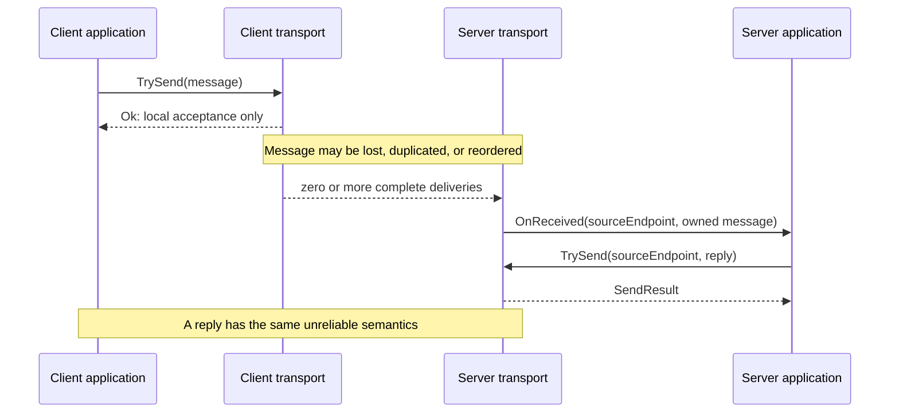
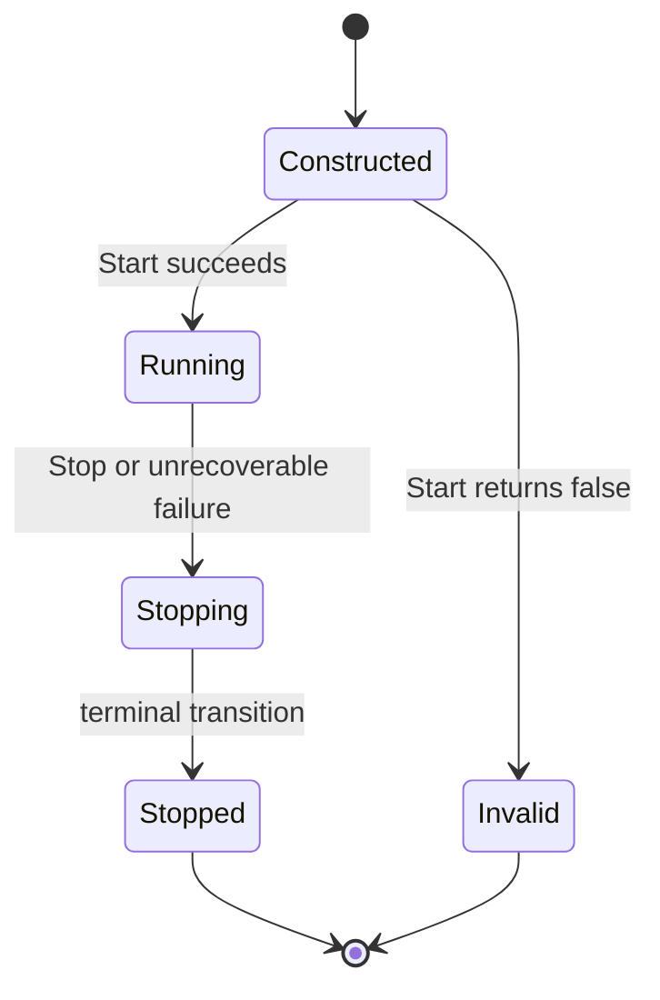

# RawUnreliableNoAck Transport Specification

## 1. Scope

RawUnreliableNoAck is a bidirectional, connectionless transport contract for
opaque `UnionDataList` messages. It defines:

- client-to-server and server-to-client message exchange;
- complete-message boundaries and maximum message size;
- intentionally unreliable delivery semantics;
- serialized receive callbacks and buffer ownership;
- endpoint routing rules for server replies; and
- transport lifecycle, failure, and application responsibilities.

This specification is implementation-agnostic. It does **not** define a wire
format, interoperability between implementations, configuration syntax, peer
discovery, authentication, authorization, confidentiality, integrity
protection, replay protection, acknowledgement, retry, timeout, or queue
capacity. Those concerns belong to a selected implementation or a protocol
layered above this transport.

## 2. Normative language

The key words **MUST**, **MUST NOT**, **REQUIRED**, **SHOULD**, **SHOULD NOT**,
and **MAY** in this document are to be interpreted as described in
[RFC 2119](https://datatracker.ietf.org/doc/html/rfc2119).

## 3. Terms and roles

| Term | Meaning |
| --- | --- |
| **client** | A transport configured with one remote server destination. |
| **server** | A transport that receives messages addressed to its configured listen address and can reply through a source endpoint. |
| **message** | One logical `UnionDataList` supplied to `TrySend` or delivered to `OnReceived`. |
| **accepted send** | A `TrySend` call that returns `SendResult.Ok`. It has been accepted for local transport processing only. |
| **delivery** | One `OnReceived` invocation for a message. A delivered duplicate is a separate delivery. |
| **source endpoint** | The `IEndPoint` supplied with a server `OnReceived` callback. It identifies a reply route for the running server instance. |
| **running** | The period after a successful `Start` and before stopping begins. |

RawUnreliableNoAck has no connection, session, admission, handshake, peer
connected/disconnected callback, keep-alive, reconnection, or resume concept.
`IEndPoint` is routing metadata, not a logical session or security principal.

## 4. Responsibilities at a glance

| Topic | Guaranteed by RawUnreliableNoAck | Application responsibility | Implementation-defined |
| --- | --- | --- | --- |
| Delivery | Preserves each delivered message's boundary and logical content. Loss, duplication, and reordering are all permitted. | Make operations idempotent; add sequence numbers, deduplication, receipts, retries, or ordering above this layer when required. | Carrier and queue behavior that causes a particular delivery outcome. |
| Sending | `Ok` means local acceptance only, never peer receipt. Every call consumes its message buffer. | Handle every `SendResult`; retry only with a newly created logical message. | Queue capacity, drain rate, and scheduling. |
| Callbacks | Receive callbacks are globally serialized per transport instance and non-reentrant. | Subscribe at most one handler, return promptly, release received buffers, and protect state shared with other code. | Callback thread or scheduler. |
| Routing | A server can reply through a source endpoint received from that server. Equal endpoints identify the same route while the server runs. | Retain only server-issued endpoints and treat them as unauthenticated metadata. | Endpoint representation and carrier addressing. |
| Failure | Invalid inbound data and application callback exceptions terminate only the affected delivery. Unrecoverable transport failure stops and invalidates the transport. | Observe `onStopped`, recreate a transport after terminal failure, and log or surface application failures. | Failure detection mechanism and timing. |
| Security | No authentication, authorization, confidentiality, integrity, or replay protection. | Implement required protection above this layer or select an appropriately protected carrier. | Any implementation-specific protection outside this contract. |

## 5. Connectionless model and message path

A client is locally ready after it starts; it does not establish or await a
connection. A server does not admit clients or create sessions. Each valid
inbound message is independently eligible for delivery.



The callback for a message accepted by `TrySend` **MUST NOT** begin before
that `TrySend` call returns. Delivery may otherwise occur on any
implementation-selected scheduler after local acceptance.

For each accepted send, in either direction, all of the following outcomes are
permitted:

1. no delivery;
2. one delivery;
3. multiple deliveries; and
4. delivery in any order relative to any other message.

There is no at-most-once, at-least-once, exactly-once, FIFO, causal, or total
ordering guarantee. A sender **MUST NOT** infer a delivery outcome from
`SendResult.Ok`. An application requiring confirmation **MUST** define a
receipt protocol above this transport.

When the transport does deliver a message, it **MUST** invoke `OnReceived`
exactly once for that delivery with one complete `UnionDataList` containing
the same logical content. The transport **MUST NOT** fragment one message
across callbacks, merge messages into one callback, or alter a message's
logical content. This is not cryptographic integrity: a malicious or spoofed
source can still provide arbitrary valid content.

## 6. Lifecycle



`Start` requires a non-null `onStopped` callback. Passing null **MUST** throw
`ArgumentNullException` without changing the instance lifecycle state.

`Start` is a one-time operation. Concurrent calls to `Start` are safe, but at
most one call **MAY** return `true`; every racing or later call **MUST** return
`false`. A successful `Start` makes the server able to receive at its configured
address and makes the client locally able to send and receive from its configured
remote destination. It does not imply peer reachability or establish a session.

If the initial `Start` attempt returns `false`, the instance **MUST** become
invalid, **MUST NOT** invoke the supplied `onStopped` callback, and **MUST NOT**
be restarted. A later or racing `Start` call returns `false` without changing
the already terminal lifecycle state. After a successful start, stopping is
terminal: a stopped transport **MUST NOT** be restarted or reinitialized. A
normal stop does not invalidate the instance: `IsValid` remains true while
`IsStarted` becomes false. A `Stop` call before a successful `Start` is a no-op
and returns `true`.

For each successful `Start(onStopped)`, `onStopped` **MUST** be invoked exactly
once after the terminal state transition when the transport subsequently stops,
whether by `Stop` or an unrecoverable internal or carrier failure. The callback
MAY be invoked synchronously or asynchronously; `Stop` is not required to wait
for it. Such a failure **MUST** make the transport invalid. `Stop(reason)`
**MAY** provide `onStopped` with a
transport-generated reason that preserves the supplied reason as its cause;
callers **MUST NOT** require object identity with the supplied reason.

`Stop` is thread-safe and may be called from `OnReceived`. Once it returns, no
new `OnReceived` invocation may begin. A handler already running may finish
asynchronously. The transport may discard all accepted-but-undelivered
outbound messages and queued-but-not-yet-invoked inbound messages while
stopping. Calling `Stop` on a valid transport that is already stopped returns
`true`; it returns `false` after the transport has become invalid.

`IsValid` and `IsStarted` **MUST** be safe for concurrent reads.
`IsStarted` is true only while the transport is running. `IsValid` becomes
false after a failed start or an unrecoverable failure.

## 7. Message model, size, and delivery

`MessageMaxByteSize` is immutable and safe for concurrent reads during the
entire transport-instance lifetime. It is an inclusive limit on the serialized
`UnionDataList` representation, including list and element encoding but
excluding carrier framing. The limit applies to both sent and received
messages. It **MUST** be large enough to admit an empty `UnionDataList`.
`UnionDataList.GetDataSize()` defines the serialized size for this contract.
Empty messages are valid.

An implementation **MUST NOT** invoke `OnReceived` for an inbound message that
is malformed, cannot be decoded as a `UnionDataList`, or exceeds
`MessageMaxByteSize`. It **MUST** discard and log that message, and **MUST
NOT** stop or invalidate the transport solely because of it.

A client **MUST** expose through `OnReceived` only messages accepted as
originating from its configured remote destination. This filter is routing
only; it supplies no proof that a message actually originated with a trusted
peer. A running server **MUST** treat each valid bounded message addressed to
its listen address as eligible for delivery, without requiring a prior
registration, connection, or admission exchange from its source.

## 8. `TrySend` and `SendResult`

Client and server `TrySend` operations are thread-safe. They may run
concurrently with each other and with `Stop`; the outcome is determined by
their operation ordering. A `TrySend` call made before successful start, while
stopping, or after stopping **MUST** return `Error`. A RawUnreliableNoAck
implementation **MUST NOT** return `NotConnected`.

Every `TrySend` invocation transfers ownership of its non-null message
argument to the transport regardless of its result. After the call, the caller
**MUST NOT** read, mutate, retain, release, or retry with that
`UnionDataList`. The transport **MUST** eventually release the transferred
reference, including when it rejects the message synchronously. A retry
requires a new buffer containing the same logical message.

```csharp
SendResult result = client.TrySend(message); // Ownership always transfers.

if (result == SendResult.BufferOverflow)
{
    ScheduleRetryWithNewMessage();
}
```

An implementation **MUST** select a result using this precedence: transport
state, message validity and serializability, message size, server destination
validity, outbound capacity, then other synchronous errors.

| Result | Required meaning |
| --- | --- |
| `Ok` | The transport accepted the message for local processing. It is not a carrier submission guarantee, peer receipt, or delivery guarantee. |
| `InvalidMessage` | The message is null, malformed, or cannot be serialized. |
| `MessageTooBig` | The serialized message exceeds `MessageMaxByteSize`. |
| `InvalidAddress` | A server destination is not a valid endpoint issued by that running server. |
| `BufferOverflow` | The implementation cannot accept the message because its finite outbound capacity is full. |
| `NotConnected` | Defined by the shared enum for connection-oriented transport contracts. RawUnreliableNoAck **MUST NOT** return it. |
| `Error` | The transport is unavailable or another unclassified synchronous sending error occurred. |

Every synchronous non-`Ok` result is non-fatal: it **MUST NOT** stop or
invalidate the transport. `BufferOverflow` is not a delivery failure
notification and carries no queue-drained or writable signal. Capacity,
scheduling, and drain rate are implementation-defined. Applications **MUST**
choose their own retry and backpressure policy.

## 9. Callback concurrency and buffer ownership

For one transport instance, all `OnReceived` invocations **MUST** be globally
serialized, including server messages from different source endpoints. A new
callback **MUST NOT** begin until the previous callback has returned. Callbacks
are non-reentrant: a `TrySend` from a handler must not cause a nested
`OnReceived` invocation on that same transport. This guarantee does not give
the application thread affinity; implementations may use any scheduler.

An application **MUST** attach at most one `OnReceived` subscriber to a
transport. A multi-subscriber event cannot safely share a single
callback-owned buffer and is outside this contract. An application that needs
fan-out **MUST** perform it in its sole handler using its own retention or
copying policy. If no handler is attached when a message arrives, the
transport **MUST** release and drop the message immediately rather than queue
it for a later subscriber.

Each `OnReceived` delivery transfers one independently owned `UnionDataList`
reference to the handler. The handler:

1. **MUST** release that reference exactly once when it no longer needs it;
2. **MAY** mutate it while it owns the reference; and
3. **MAY** retain the callback-owned reference beyond callback return without
   acquiring another reference, provided it releases the reference exactly
   once later.

Duplicate deliveries each provide their own independently owned message
reference. A handler that throws **MUST** still release any message reference
it owns, normally with `try`/`finally`. The transport **MUST** catch a handler
exception, suppress further processing of only that affected delivery, and
continue running. Because ownership has transferred to the handler, the
transport is not required to release a reference that a throwing handler failed
to release. It **MUST NOT** stop or invalidate the transport solely because
the handler threw.

Handlers **MUST** return promptly and **MUST NOT** perform blocking or
long-running work. Slow handling delays every later receive delivery on that
transport and can contribute to application-visible loss or backpressure.
The contract defines no callback timeout or automatic penalty.

## 10. Endpoint and routing rules

The server `TrySend(IEndPoint destination, UnionDataList message)` overload
accepts an endpoint obtained from that same server's `OnReceived` callback, or
an endpoint equal to one, until the server stops. An endpoint that compares
equal through `IEndPoint.Equals` identifies the same reply route for the
lifetime of the running server and may be used as a dictionary key. Equal
endpoints **MUST** return the same `GetHashCode` value during that lifetime.

An endpoint is not an authenticated identity, authorization claim, proof of
ownership, or replay-protected session handle. Applications **MUST** validate
any identity or authorization information independently and **MUST NOT** trust
an endpoint alone for a security decision.

## 11. Failure, shutdown, and implementation-defined behavior

Unrecoverable internal or carrier failure after successful start **MUST** stop
and invalidate the transport, discard work that has not begun delivery, and
invoke `onStopped` exactly once. The exact detection mechanism, timing, and
failure reason representation are implementation-defined.

The following behavior is explicitly implementation-defined, provided it does
not weaken the requirements in this specification:

- carrier and wire encoding, including interoperability with other
  implementations;
- address configuration, endpoint representation, and source filtering
  mechanism;
- callback scheduler and execution thread;
- `onStopped` dispatch scheduler and timing after the terminal state transition;
- outbound queue capacity, scheduling, and drain rate;
- carrier submission timing after `TrySend` returns `Ok`;
- internal logging format and sink;
- mechanisms and timing for unrecoverable failure detection; and
- implementation-specific protection layered beneath this transport.

## 12. Security considerations and conformance checklists

RawUnreliableNoAck provides no peer authentication, authorization,
confidentiality, cryptographic integrity, tamper detection, source-spoofing
protection, or replay protection. A server can receive valid messages from any
source reaching its listen address, and a client-side source filter does not
authenticate that source. Applications handling sensitive, privileged, or
non-idempotent operations **MUST** add the required authentication, integrity,
confidentiality, anti-replay, deduplication, ordering, and receipt mechanisms
above this transport, or choose a protected transport stack.

### 12.1 Application-author checklist

- [ ] Treat every accepted send as potentially lost, duplicated, and reordered.
- [ ] Implement idempotency, sequence handling, acknowledgements, retries, and
      receipts when the application needs them.
- [ ] Treat `SendResult.Ok` only as local acceptance.
- [ ] Never access or release a message after passing it to `TrySend`.
- [ ] Release each received message exactly once, even if processing fails.
- [ ] Attach at most one receive handler and fan out only under application
      ownership.
- [ ] Keep receive handlers prompt, non-blocking, and exception-safe.
- [ ] Use only endpoints received from the same running server for replies.
- [ ] Treat endpoints and messages as unauthenticated, untrusted input.
- [ ] Observe `onStopped` and create a new transport instance after terminal
      failure or stop.

### 12.2 Transport-implementer checklist

- [ ] Provide connectionless operation without admission, handshake, sessions,
      or peer lifecycle callbacks.
- [ ] Preserve complete-message boundaries and logical content for every
      delivery.
- [ ] Permit loss, duplication, and reordering without claiming a stronger
      delivery property.
- [ ] Defer peer callback invocation until after the sending `TrySend` returns.
- [ ] Serialize all receive callbacks globally per transport and prevent
      callback reentrancy.
- [ ] Transfer and release sent and received buffers according to this
      specification.
- [ ] Drop and log malformed or oversized inbound data without stopping.
- [ ] Catch application callback exceptions, discard only the affected message,
      and continue running.
- [ ] Make `TrySend`, `Stop`, status reads, and concurrent `Start` calls safe
      under the specified concurrency rules.
- [ ] Preserve the specified lifecycle and `onStopped` behavior, including
      terminal invalidation after failed start or unrecoverable failure.
- [ ] Document carrier-specific configuration, capacity, scheduling, failure,
      and protection behavior without weakening this contract.
