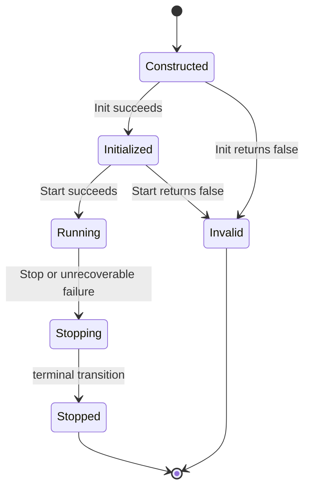
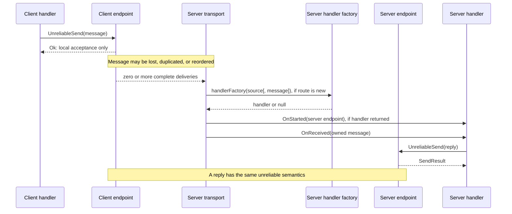

# RawUnreliable Transport Specification (Common Core)

## 1. Scope

RawUnreliable is a bidirectional, connectionless transport contract for
opaque `UnionDataList` messages. It defines:

- client-to-server and server-to-client message exchange;
- complete-message boundaries and maximum message size;
- intentionally unreliable delivery semantics;
- endpoint-based receive handling, lifecycle, and buffer ownership;
- server source-route creation and routing rules; and
- transport and endpoint failure and shutdown responsibilities.

This document is the common core shared by the two RawUnreliable variant
contracts: **RawUnreliableNoAck** and **RawUnreliableAck**. The variants
differ only in the server handler factory. A NoAck server factory receives the
inbound source route; an Ack server factory additionally receives the
triggering message. Each variant specification is normative for its factory
signature and source-route acceptance rules; this document is normative for
everything else.

This specification is implementation-agnostic. It does **not** define a wire
format, interoperability between implementations, configuration syntax, peer
discovery, authentication, authorization, confidentiality, integrity
protection, replay protection, acknowledgement, retry, timeout, or queue
capacity. Those concerns belong to a selected implementation or a protocol
layered above this transport.

## 2. Normative language

The key words **MUST**, **MUST NOT**, **REQUIRED**, **SHOULD**, **SHOULD NOT**,
and **MAY** in this document are to be interpreted as described in
[RFC 2119](https://datatracker.ietf.org/doc/html/rfc2119).

## 3. Public contract

```csharp
public interface IRawUnreliableClient : IRawUnreliableTransport
{
    bool Init(IRawUnreliableHandler handler);
}

public interface IRawUnreliableEndpoint : IRawEndpoint
{
    bool IsValid { get; }
    SendResult UnreliableSend(UnionDataList message);
    bool Stop(StopReason? reason = null);
}

public interface IRawUnreliableHandler : IRawHandler
{
    void OnStarted(IRawUnreliableEndpoint endpoint);
    void OnStopped(StopReason reason);
}
```

`IRawHandler` supplies `OnReceived(UnionDataList receivedBuffer)`.

The server contract is variant-defined. Both `IRawUnreliableNoAckServer` and
`IRawUnreliableAckServer` extend `IRawUnreliableTransport` and each declares a
variant `Init` binding a server handler factory; the exact signatures are
defined by the variant specifications.

Clients and servers expose neither a transport-level receive event nor a
transport-level `TrySend` operation. A handler receives an
`IRawUnreliableEndpoint` through `OnStarted` and uses that endpoint for both
sending and endpoint-local stopping.

## 4. Terms and roles

| Term | Meaning |
| --- | --- |
| **client** | A transport configured with one remote server destination. It owns one client endpoint while running. |
| **server** | A transport that receives messages addressed to its configured listen address. It creates an endpoint and handler for each accepted source route. |
| **transport** | One `IRawUnreliableClient` or one variant server (`IRawUnreliableNoAckServer` or `IRawUnreliableAckServer`) instance. |
| **endpoint** | An `IRawUnreliableEndpoint` representing one route usable by application code for sending and receiving. It is not an `IEndPoint` routing value. |
| **source route** | A server-side route identified by an `IEndPoint` supplied to the variant server handler factory from an inbound message source. |
| **message** | One logical `UnionDataList` supplied to `UnreliableSend` or delivered to `OnReceived`. |
| **accepted send** | An `UnreliableSend` call that returns `SendResult.Ok`. It has been accepted for local transport processing only. |
| **delivery** | One `OnReceived` invocation for a message. A delivered duplicate is a separate delivery. |
| **running** | The period after a successful `Start` and before stopping begins. |
| **valid endpoint** | An endpoint for which `IsValid` is true and which may accept sends. |

RawUnreliable has no connection, session, admission, handshake, peer
connected/disconnected callback, keep-alive, reconnection, or resume concept.
An endpoint is a local application handle for a routing path, not a logical
session or security principal. `IEndPoint` is routing metadata, not a logical
session or security principal.

## 5. Responsibilities at a glance

| Topic | Guaranteed by RawUnreliable | Application responsibility | Implementation-defined |
| --- | --- | --- | --- |
| Delivery | Preserves each delivered message's boundary and logical content. Loss, duplication, and reordering are all permitted. | Make operations idempotent; add sequence numbers, deduplication, receipts, retries, or ordering above this layer when required. | Carrier and queue behavior that causes a particular delivery outcome. |
| Sending | `Ok` means local acceptance only, never peer receipt. Every call consumes its message buffer. | Handle every `SendResult`; retry only with a newly created logical message. | Queue capacity, drain rate, and scheduling. |
| Handlers | Each endpoint's callbacks are serialized and non-reentrant. Server endpoints may invoke callbacks concurrently with other server endpoints. | Return promptly, release received buffers, and protect state shared between handlers. | Callback thread or scheduler. |
| Routing | A client has one configured route. A server creates endpoint routes from valid inbound sources and binds each endpoint to one equal source route while valid. | Return null from the factory to decline a source message; treat endpoint metadata as unauthenticated. | Endpoint representation and carrier addressing. |
| Endpoint failure | A stopped or internally invalidated endpoint stops its handler callbacks. A server can later create a new endpoint for the same source route. | Observe `OnStopped`; retain no expectation that an invalid endpoint will become valid again. | Endpoint failure detection mechanism and timing. |
| Conformance | An implementation claiming Carrier-Independent Core Conformance exposes the variant transport and endpoint test controls. | Use controls only in conformance adapters and never as application-plane behavior. | Whether an ordinary production instance exposes no controls or controls that remain inactive. |
| Transport failure | Unrecoverable transport failure stops and invalidates the transport. | Observe `onStopped`, recreate a transport after terminal failure, and log or surface application failures. | Failure detection mechanism and timing. |
| Security | No authentication, authorization, confidentiality, integrity, or replay protection. | Implement required protection above this layer or select an appropriately protected carrier. | Any implementation-specific protection outside this contract. |

## 6. Initialization and transport lifecycle

### 6.1 Initialization

`Init` binds the application callback object before a transport may start. A
client binds one non-null `IRawUnreliableHandler`. A server binds one non-null
variant handler factory; the factory signature is defined by the variant
specification.

Passing null to `Init` **MUST** throw `ArgumentNullException` without changing
the transport state. A server factory returning null is valid and is not an
`Init` failure.

`Init` is a one-time operation. Concurrent calls are safe, but at most one
call may return true. Every racing or later call **MUST** return false. A
successful `Init` does not invoke `OnStarted`, create a server endpoint, or
start carrier activity.

The initial eligible `Init` attempt either succeeds or terminally invalidates
the transport. If it returns false, `IsValid` **MUST** become false, no later
`Init` or `Start` may succeed, and no `onStopped` callback is invoked. Calling
`Init` after a successful `Start`, after stopping begins, or after the
transport is invalid **MUST** return false.

`Start` requires a successful `Init`. Calling `Start` before successful
initialization **MUST** return false and terminally invalidate the transport
under the failed-start rules below.

### 6.2 Transport state



`Start` requires a non-null `onStopped` callback. Passing null **MUST** throw
`ArgumentNullException` without changing the instance lifecycle state.

`Start` is a one-time operation. Concurrent calls are safe, but at most one
call **MAY** return true; every racing or later call **MUST** return false. A
successful `Start` makes the server able to receive at its configured address
and makes the client locally able to send and receive from its configured
remote destination. It does not imply peer reachability or establish a
session.

If the initial `Start` attempt returns false, including because `Init` has not
succeeded, the instance **MUST** become invalid, **MUST NOT** invoke the
supplied `onStopped` callback, and **MUST NOT** be restarted. A later or
racing `Start` call returns false without changing the already terminal
lifecycle state.

After a successful start, stopping is terminal: a stopped transport **MUST
NOT** be restarted or reinitialized. A normal transport stop does not
invalidate the instance: `IsValid` remains true while `IsStarted` becomes
false. An unrecoverable internal or carrier failure **MUST** invalidate the
transport. A `Stop` call before a successful `Start` is a no-op and returns
true.

For each successful `Start(onStopped)`, `onStopped` **MUST** be invoked
exactly once after the terminal state transition when the transport
subsequently stops, whether by `Stop`, an endpoint action that stops a client,
or an unrecoverable internal or carrier failure. The callback MAY be invoked
synchronously or asynchronously; `Stop` is not required to wait for it. A
transport-generated reason MAY preserve a supplied reason as its cause;
callers **MUST NOT** require object identity with a supplied reason.

`Stop` is thread-safe and may be called from a handler. Once it returns, no
new `OnReceived` invocation may begin on any endpoint of that transport. A
handler already running may finish asynchronously. The transport may discard
all accepted-but-undelivered outbound messages and queued-but-not-yet-invoked
inbound messages while stopping. Calling `Stop` on a valid transport that is
already stopped returns true; it returns false after the transport has become
invalid.

`IsValid` and `IsStarted` **MUST** be safe for concurrent reads. `IsStarted`
is true only while the transport is running. `IsValid` becomes false after a
failed initialization, a failed start, or an unrecoverable transport failure.

### 6.3 Client endpoint startup

After `client.Start` has successfully returned true, the client **MUST** make
its single endpoint valid and invoke `handler.OnStarted(endpoint)`. The
endpoint is usable from `OnStarted`. The client **MUST NOT** deliver an
`OnReceived` callback before `OnStarted` returns successfully.

If client `OnStarted` throws, the transport **MUST** catch and log the
exception, invalidate the client endpoint, stop the client transport, and
invoke the transport-level `onStopped` callback exactly once. The throwing
handler **MUST NOT** receive `OnStopped`. This is a stop after successful
transport startup, not a failed `Start`.

## 7. Endpoint lifecycle and routing

### 7.1 Common endpoint rules

`IRawUnreliableEndpoint.IsValid` is safe for concurrent reads. It is true
when the endpoint has started successfully and remains usable. It becomes
false when endpoint stopping begins and never becomes true again.

`IRawEndpoint.RemoteEndPoint` identifies the endpoint's immutable route
metadata. For a client endpoint, it is the configured server destination. For
a server endpoint, it is the source route accepted when that endpoint was
created. It **MUST** remain available after endpoint invalidation; callers
must use `IsValid`, not a null remote endpoint, to determine whether the
endpoint is usable.

`MessageMaxByteSize` is immutable and safe for concurrent reads during the
endpoint lifetime. It has the same value and meaning as the owning transport's
`MessageMaxByteSize`.

An endpoint may stop because the application calls `endpoint.Stop`, because
the implementation detects an endpoint-local internal state change, or because
its owning transport stops. An implementation **MAY** invalidate a server
endpoint for implementation-defined endpoint-local reasons without stopping
the server transport. It **MUST NOT** invalidate a server endpoint solely
because its handler throws from `OnReceived` or `OnStopped`.

`bool Stop(StopReason? reason = null)` is thread-safe and may be called from
any endpoint callback. The one call that begins stopping a valid endpoint
**MUST** return true. Every call after endpoint invalidation, including a
racing call that loses the stop transition, **MUST** return false. The method
need not wait for a currently executing handler callback or for `OnStopped`.
If the successful call supplies null, the endpoint **MUST** use a newly created
`Pontifex.StopReasons.Unknown` reason initialized with the owning transport's
`Name` when it invokes `OnStopped`.

An endpoint whose `OnStarted` returned successfully **MUST** invoke its
handler's `OnStopped` exactly once after endpoint invalidation. During and
after `OnStopped`, `IsValid` **MUST** be false. A handler whose `OnStarted`
threw **MUST NOT** receive `OnStopped` for that failed endpoint.

If `OnStopped` throws, the transport **MUST** catch and log the exception and
otherwise continue its already-determined endpoint or transport teardown.

### 7.2 Client endpoint termination

Stopping or internally invalidating the client endpoint **MUST** stop the
client transport. If `OnStarted` completed successfully, the client **MUST**
invalidate the endpoint and schedule `handler.OnStopped(reason)` before
invoking the callback supplied to `Start(onStopped)`. The callbacks need not
complete before `endpoint.Stop` or transport `Stop` returns.

An explicit endpoint stop is a normal client transport stop unless an
unrecoverable transport or carrier failure independently applies. An
endpoint-local internal failure that is also an unrecoverable transport or
carrier failure **MUST** invalidate the client transport under the transport
failure rules.

### 7.3 Server source-route creation

For every valid bounded inbound message addressed to a running server, the
server identifies its source route using an `IEndPoint`. Equal `IEndPoint`
values identify the same route while a corresponding server endpoint is valid,
and equal values **MUST** return the same `GetHashCode` value during that
lifetime. Equality and hash code are the only route-binding keys. A binding
**MUST NOT** depend on the object identity, retention, cache entry, or other
lifetime of a particular source-endpoint representation; it remains bound while
the corresponding endpoint remains valid.

When an inbound message has no valid server endpoint for its equal source
route, the server **MUST** invoke the configured variant handler factory. The
factory arguments are defined by the variant specification: RawUnreliableNoAck
supplies only the source route; RawUnreliableAck additionally supplies the
triggering message. Route creation is atomic for equal sources: concurrent
first messages from one equal source **MUST NOT** cause multiple concurrent
factory calls or multiple endpoints. If the factory returns a handler, the
server creates one endpoint for the route, whose `RemoteEndPoint` compares
equal to the `IEndPoint` supplied to the factory. The server then invokes
`handler.OnStarted(endpoint)` and, after it returns successfully, delivers the
triggering message through `handler.OnReceived`.

While the factory or `OnStarted` is in progress for a source route, the server
**MUST** queue later valid inbound messages from that same equal source. It
**MUST NOT** invoke another factory for those pending messages. After
`OnStarted` returns successfully, the server **MUST** bind the queued messages
to the created endpoint and make them eligible for serialized delivery after
the triggering message, subject only to ordinary transport loss and inbound
capacity behavior. This does not add a general delivery-order guarantee.

If the factory returns null, the server **MUST** release and drop the
triggering message. It **MUST NOT** cache that decline: every later valid
message from the same source is eligible to invoke the factory again. Pending
messages from the same route **MUST** be processed in turn as later source
messages, rather than being bound to a declined route.

If the factory throws, the server **MUST** catch and log the exception, release
and drop the triggering message, and leave no endpoint binding for that
source. A later valid message from that source is eligible to invoke the
factory again. Pending messages from the same route **MUST** be processed in
turn as later source messages.

If a newly created server handler throws from `OnStarted`, the server **MUST**
catch and log the exception, invalidate that newly created endpoint, and
release and drop the triggering message. It **MUST NOT** invoke `OnStopped`
for that handler, stop or invalidate the server, or retain the failed route
binding. A later valid message from the same source is eligible to create a
new endpoint and handler. Pending messages from the same route **MUST** be
processed in turn as later source messages.

After a valid server endpoint stops or is internally invalidated, the server
**MUST** remove its route binding. A later valid message from the same source
**MUST** be processed as a new route and is eligible to create a new endpoint
through the factory.

### 7.4 Server and transport termination

When a server transport stops, it **MUST** invalidate all valid server
endpoints and schedule `OnStopped` for every handler whose `OnStarted`
completed successfully before invoking the server transport's `onStopped`
callback. Endpoint callbacks for different routes may still complete
asynchronously; this ordering requires notification scheduling, not that every
endpoint handler has returned before the transport callback begins.

## 8. Connectionless model and message path

A client is locally ready after its endpoint has successfully started; it does
not establish or await a connection. A server does not admit clients or create
sessions. Each valid inbound message is independently eligible for delivery or
for source-route handler selection.



The bracketed factory form denotes the variant: RawUnreliableNoAck invokes
`handlerFactory(source)`; RawUnreliableAck invokes
`handlerFactory(source, message)`. The variant specifications define the exact
invocation.

The callback for a message accepted by `UnreliableSend` **MUST NOT** begin
before that `UnreliableSend` call returns. Delivery may otherwise occur on any
implementation-selected scheduler after local acceptance.

For each accepted send, in either direction, all of the following outcomes are
permitted:

1. no delivery;
2. one delivery;
3. multiple deliveries; and
4. delivery in any order relative to any other message.

There is no at-most-once, at-least-once, exactly-once, FIFO, causal, or total
ordering guarantee. A sender **MUST NOT** infer a delivery outcome from
`SendResult.Ok`. An application requiring confirmation **MUST** define a
receipt protocol above this transport.

When the transport delivers a message, it **MUST** invoke `OnReceived` exactly
once for that delivery with one complete `UnionDataList` containing the same
logical content. The transport **MUST NOT** fragment one message across
callbacks, merge messages into one callback, or alter a message's logical
content. This is not cryptographic integrity: a malicious or spoofed source
can still provide arbitrary valid content.

## 9. Message model, size, and delivery eligibility

`MessageMaxByteSize` is an inclusive limit on the serialized `UnionDataList`
representation, including list and element encoding but excluding carrier
framing. The limit applies to both sent and received messages. It **MUST** be
large enough to admit an empty `UnionDataList`.
`UnionDataList.GetDataSize()` defines the serialized size for this contract.
Empty messages are valid.

An implementation **MUST NOT** invoke a handler, invoke a server factory, or
create a server endpoint for inbound data that is malformed, cannot be decoded
as a `UnionDataList`, or exceeds `MessageMaxByteSize`. It **MUST** discard and
log that data, and **MUST NOT** stop or invalidate the transport solely because
of it.

A client **MUST** expose through its handler only messages accepted as
originating from its configured remote destination. This filter is routing
only; it supplies no proof that a message actually originated with a trusted
peer. A running server **MUST** treat each valid bounded message addressed to
its listen address as eligible for route selection, without requiring a prior
registration, connection, or admission exchange from its source.

## 10. `UnreliableSend` and `SendResult`

`UnreliableSend` is thread-safe. It may run concurrently with `Stop` and with
other sends; the outcome is determined by operation ordering. A call made
before its endpoint starts, while its endpoint is stopping, after endpoint
stopping, or while the owning transport is not running **MUST** return `Error`.
RawUnreliable **MUST NOT** return `NotConnected`.

Every `UnreliableSend` invocation transfers ownership of its non-null message
argument to the endpoint's transport regardless of its result. After the call,
the caller **MUST NOT** read, mutate, retain, release, or retry with that
`UnionDataList`. The transport **MUST** eventually release the transferred
reference, including when it rejects the message synchronously. A retry
requires a new buffer containing the same logical message.

```csharp
SendResult result = endpoint.UnreliableSend(message); // Ownership always transfers.

if (result == SendResult.BufferOverflow)
{
    ScheduleRetryWithNewMessage();
}
```

An implementation **MUST** select a result using this precedence: endpoint and
transport state, message validity and serializability, message size, route
validity, outbound capacity, then other synchronous errors.

| Result | Required meaning |
| --- | --- |
| `Ok` | The transport accepted the message for local processing. It is not a carrier submission guarantee, peer receipt, or delivery guarantee. |
| `InvalidMessage` | The message is null, malformed, or cannot be serialized. |
| `MessageTooBig` | The serialized message exceeds `MessageMaxByteSize`. |
| `InvalidAddress` | The endpoint's underlying route is synchronously determined to be invalid. |
| `BufferOverflow` | The implementation cannot accept the message because its finite outbound capacity is full. |
| `NotConnected` | Defined by the shared enum for connection-oriented transport contracts. RawUnreliable **MUST NOT** return it. |
| `Error` | The endpoint or transport is unavailable, or another unclassified synchronous sending error occurred. |

Every synchronous non-`Ok` result is non-fatal: it **MUST NOT** by itself stop
or invalidate the endpoint or transport. `BufferOverflow` is not a delivery
failure notification and carries no queue-drained or writable signal.
Capacity, scheduling, and drain rate are implementation-defined. Applications
**MUST** choose their own retry and backpressure policy.

## 11. Callback concurrency and buffer ownership

For one endpoint, `OnStarted`, every `OnReceived`, and `OnStopped` **MUST** be
serialized and non-reentrant. `OnReceived` **MUST NOT** begin until
`OnStarted` has returned successfully. `OnStopped` **MUST NOT** begin until an
already-running callback for that endpoint has returned. Once endpoint
invalidation begins, no new `OnReceived` invocation may begin for that
endpoint.

Callbacks for different server endpoints **MAY** run concurrently. This
contract provides no global callback serialization across a server's source
routes. The application **MUST** protect state shared across handlers or
endpoints. A client has only one endpoint, so its handler callbacks are
serialized by the endpoint rule.

A server **MUST** serialize `handlerFactory` invocations globally: two factory
calls, including calls for unequal source routes, **MUST NOT** overlap. This
does not require a factory invocation to wait for existing endpoint callbacks,
and it does not require callbacks for different successfully created endpoints
to be serialized. The permission for different endpoint callbacks to overlap
does not impose a concurrency or forward-progress requirement; an
implementation that globally serializes endpoint callbacks remains conformant.

Callbacks are non-reentrant for one endpoint: an `UnreliableSend` or `Stop`
from a handler **MUST NOT** cause a nested callback invocation on that same
endpoint. The contract does not give the application thread affinity;
implementations may use any scheduler.

Each `OnReceived` delivery transfers one independently owned `UnionDataList`
reference to the handler. The handler:

1. **MUST** release that reference exactly once when it no longer needs it;
2. **MAY** mutate it while it owns the reference; and
3. **MAY** retain the callback-owned reference beyond callback return without
   acquiring another reference, provided it releases the reference exactly
   once later.

Duplicate deliveries each provide their own independently owned message
reference. A handler that throws **MUST** still release any message reference
it owns, normally with `try`/`finally`. The transport **MUST** catch an
`OnReceived` exception, suppress further processing of only that delivery, and
continue running. Because ownership has transferred to the handler, the
transport is not required to release a reference that a throwing handler failed
to release. It **MUST NOT** stop or invalidate an endpoint or transport solely
because `OnReceived` threw.

Handlers and factories **MUST** return promptly and **MUST NOT** perform
blocking or long-running work. Slow handling delays later deliveries for the
same endpoint and can contribute to application-visible loss or backpressure.
The contract defines no callback timeout or automatic penalty.

## 12. Conformance controls

### 12.1 Scope and exposure

This section defines test-only controls required only from an implementation
claiming Carrier-Independent Core Conformance. A conformance adapter obtains a
transport control through `ITransport.GetControls` before starting the
transport. A handler obtains an endpoint control through
`IRawUnreliableEndpoint.GetControls` after receiving that endpoint in
`OnStarted`.

Implementations MAY expose these controls only from instances constructed by a
conformance adapter. Ordinary production instances MUST NOT incur
conformance-control hot-path overhead. Controls MUST NOT inject packets,
intercept application messages, fabricate `SendResult` values, or directly
invoke application callbacks.

All checkpoint controls described below are inactive until armed by a test.
When armed, a checkpoint hit invokes `ICheckPoint.Hit` and blocks according to
its `ICheckPointCtl`. Every returned control and getter MUST be safe for
concurrent use.

### 12.2 Transport conformance control

The transport control is named
`IRawUnreliableTransportConformanceControl` and extends
`IRawUnreliableConformanceControl`. It therefore retains the transport-wide
members inherited from `IConformanceControl`:

- `BeforeStopStateTransitionGate`;
- `BeforeStoppedCallbackGate`;
- `FailNextStart()`; and
- `InjectUnrecoverableFailure()`.

`FailNextStart()` and `InjectUnrecoverableFailure()` apply to the whole
transport exactly as defined by `IConformanceControl`. In particular, injected
unrecoverable failure follows the ordinary transport failure path, invalidates
all valid endpoints, and preserves this specification's endpoint-stop callback
ordering. It MUST NOT fabricate data-plane or handler activity.

The transport-specific control additionally exposes these members:

```csharp
ICheckPointCtl BeforeHandlerFactoryGate { get; }
ICheckPointCtl BeforeHandlerStartedGate { get; }
bool TryMakeReliable();
```

`BeforeHandlerFactoryGate` is hit once immediately before each server
`handlerFactory` invocation. It is not hit for malformed, oversized, stopped,
or otherwise discarded inbound data. It is not hit for a client transport. The
gate participates in the global factory serialization rule.

`BeforeHandlerStartedGate` is hit once immediately before an endpoint's
`handler.OnStarted(endpoint)` invocation. It is hit for both client and server
endpoints after the endpoint has become valid, but before application callback
execution. It is not hit when no handler is selected or when no endpoint is
created.

`TryMakeReliable()` is a transport-wide test mode and MUST be called before
`Start`. Calling it after starting begins is unsupported. When it returns true,
every endpoint route owned by that transport, including every server route
created later, is placed in reliable debug mode with its matching peer route.
For each direction, every message accepted with `SendResult.Ok` while both
matching endpoints are running MUST be delivered exactly once in FIFO operation
order. The mode applies in both directions for every matching peer route. It
returns false if the implementation cannot provide this test mode. This mode is
solely a conformance aid and does not change RawUnreliable production
semantics.

Each variant names its transport control type: `IRawUnreliableNoAckTransportConformanceControl`
and `IRawUnreliableAckTransportConformanceControl` both extend
`IRawUnreliableTransportConformanceControl`. See the variant specifications.

### 12.3 Endpoint conformance control

The endpoint control is named
`IRawUnreliableEndpointConformanceControl` and extends `IControl`. It
exposes these members:

```csharp
ICheckPointCtl BeforeEndpointStopStateTransitionGate { get; }
ICheckPointCtl BeforeHandlerStoppedGate { get; }
ICheckPointCtl BeforeSendCommitGate { get; }
ICheckPointCtl AfterSendCommitGate { get; }
ICheckPointCtl AfterReceivedGate { get; }
```

`BeforeEndpointStopStateTransitionGate` is hit when a valid endpoint is about
to transition to invalid, whether the cause is endpoint `Stop`, endpoint-local
failure, or owning-transport stop. The checkpoint occurs before that transition
becomes visible to a concurrent `IsValid` read.

`BeforeHandlerStoppedGate` is hit once immediately before the endpoint invokes
`handler.OnStopped`. The endpoint has already become invalid at this point. It
is not hit for a handler whose `OnStarted` threw and therefore receives no
`OnStopped` callback.

`BeforeSendCommitGate` is hit when a message accepted from this endpoint is
about to reach an underlying IO commit attempt. Synchronously rejected
messages and accepted messages discarded before a commit attempt do not hit
this gate. `AfterSendCommitGate` is hit after that endpoint message completes
an underlying IO commit attempt.

`AfterReceivedGate` is hit once per impending `OnReceived` invocation for this
endpoint, immediately before it begins. It is not hit for malformed,
oversized, stopped, discarded, pending-startup, or undeliverable messages. It
is not hit for `OnStarted` or `OnStopped`.

Each variant names its endpoint control type: `IRawUnreliableNoAckEndpointConformanceControl`
and `IRawUnreliableAckEndpointConformanceControl` both extend
`IRawUnreliableEndpointConformanceControl`. See the variant specifications.

## 13. Failure, shutdown, and implementation-defined behavior

An unrecoverable internal or carrier failure after successful start **MUST**
stop and invalidate the transport, discard work that has not begun delivery,
invalidate all of its valid endpoints, and invoke `onStopped` exactly once. For
a server, endpoint `OnStopped` notifications must be scheduled first as
specified in section 7.4. The exact detection mechanism, timing, and failure
reason representation are implementation-defined.

The following behavior is explicitly implementation-defined, provided it does
not weaken the requirements in this specification:

- carrier and wire encoding, including interoperability with other
  implementations;
- address configuration, endpoint representation, and source filtering
  mechanism;
- callback scheduler and execution thread;
- `onStopped` dispatch scheduler and timing after the terminal state
  transition;
- outbound queue capacity, scheduling, and drain rate;
- carrier submission timing after `UnreliableSend` returns `Ok`;
- endpoint-local internal failure mechanisms and timing;
- internal logging format and sink;
- mechanisms and timing for unrecoverable transport failure detection; and
- implementation-specific protection layered beneath this transport.

## 14. Security considerations and conformance checklists

RawUnreliable provides no peer authentication, authorization,
confidentiality, cryptographic integrity, tamper detection, source-spoofing
protection, or replay protection. A server factory and a server handler can
receive valid messages from any source reaching the listen address, and a
client-side source filter does not authenticate that source. Applications
handling sensitive, privileged, or non-idempotent operations **MUST** add the
required authentication, integrity, confidentiality, anti-replay,
deduplication, ordering, and receipt mechanisms above this transport, or choose
a protected transport stack.

### 14.1 Application-author checklist

- [ ] Call `Init` exactly once before `Start`.
- [ ] Treat every accepted send as potentially lost, duplicated, and reordered.
- [ ] Implement idempotency, sequence handling, acknowledgements, retries, and
      receipts when the application needs them.
- [ ] Treat `SendResult.Ok` only as local acceptance.
- [ ] Never access or release a message after passing it to `UnreliableSend`.
- [ ] Release each received message exactly once, even if processing fails.
- [ ] Keep handlers and server factories prompt, non-blocking, and
      exception-safe.
- [ ] Protect state shared by multiple server endpoint handlers.
- [ ] Treat null factory results as one-message source declines, not persistent
      blocks.
- [ ] Treat endpoint metadata and messages as unauthenticated, untrusted input.
- [ ] Observe endpoint `OnStopped` and transport `onStopped`; do not expect an
      invalid endpoint or stopped transport to restart.

### 14.2 Transport-implementer checklist

- [ ] Enforce one-time, pre-start initialization and terminal invalidation on
      failed initialization or start.
- [ ] Provide connectionless operation without admission, handshake, sessions,
      or peer lifecycle callbacks.
- [ ] Create server endpoints atomically per equal source route and recreate
      them after endpoint termination.
- [ ] Queue same-route messages during factory and handler startup, and process
      them according to the route-selection outcome.
- [ ] Serialize all factory invocations while allowing endpoint callback
      concurrency only as permitted by this contract.
- [ ] Preserve complete-message boundaries and logical content for every
      delivery.
- [ ] Permit loss, duplication, and reordering without claiming a stronger
      delivery property.
- [ ] Defer peer callback invocation until after the sending `UnreliableSend`
      returns.
- [ ] Serialize callbacks per endpoint, prevent endpoint callback reentrancy,
      and allow server endpoints to proceed independently.
- [ ] Transfer and release sent and received buffers according to this
      specification.
- [ ] Drop and log malformed or oversized inbound data without stopping.
- [ ] Apply the required null-factory, factory-exception, and `OnStarted`
      failure behavior for server source routes.
- [ ] Catch application callback exceptions as specified and keep unrelated
      endpoint and transport activity running.
- [ ] Make initialization, `Start`, endpoint and transport `Stop`, sends,
      status reads, and concurrent source-route creation safe under the
      specified concurrency rules.
- [ ] Preserve endpoint and transport stop callback ordering, including
      endpoint notification before transport `onStopped` notification.
- [ ] Expose the variant transport and endpoint conformance controls from
      conformance-adapter instances, including all required checkpoints and
      pre-start transport-wide reliable debug mode.
- [ ] Document carrier-specific configuration, capacity, scheduling, failure,
      and protection behavior without weakening this contract.
